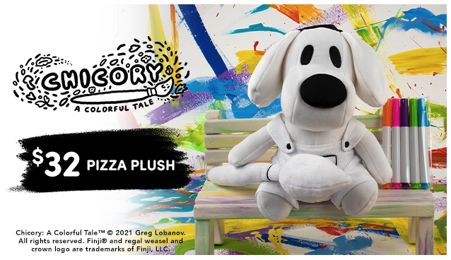

+++
title = "We finally made a Chicory plush"
slug = "we-finally-made-a-chicory-plush"
description = "And you can DRAW ON IT"
[taxonomies]
tags = ["archived",]
+++
<figure></figure>
<a class="button primary" href="https://www.fangamer.com/products/chicory-pizza-plush">Check it out!</a>

This has been a long time coming!!! Getting Pizza’s weird, beany head and body shape just right took some real time and effort. Fangamer also went above and beyond with cool features, like magnets in the hand + brush to make them all stick to each other, and, yes… the entire plush is made of washable, markerable material so you can go nuts and draw all over them. It’s kind of cute, and kind of deranged, and we love it.

Thank you Fangamer for this incredible opportunity. I genuinely don’t know how many of these they’ll make or how long they’ll be available so don’t hesitate to check it out.

<em>(I migrated all my newsletters to this new consolidated one. If you only want updates on certain topics you can <a href="https://greglobanov.substack.com/account">edit your subscription here.</a>)</em>
