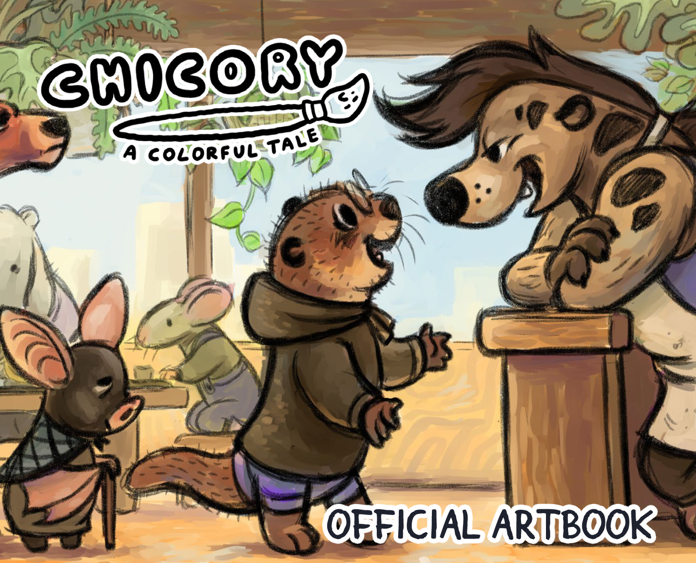

+++
title = "Introducing... the Official Chicory Artbook!"
slug = "introducing-the-official-chicory"
description = "189 pages of juicy details, sketches and more!"
[taxonomies]
tags = ["archived","chicory"]
+++
<figure></figure>
<a class="button primary" href="https://banov.itch.io/chicory-a-colorful-art-book">Check it out HERE!</a>

It’s been a long time coming. We’re proud to reveal this 189-page official digital artbook for Chicory :) We had promised to (and wanted to!) make this for Kickstarter backers… but what started off as a seemingly simple project became a long journey for us. We collected art and notes from many years of development and worked with a fabulous layout artist (Hayley Ng!) to make a professional final package.

There are concept drawings, sketches, articles, interviews, never-before-seen characters and all manner of juicy process details to uncover in here. We wanted to give fans a new peek into the world, but we also wanted to share our process in a way that we think any creator can get inspired by.

We’re very proud of this and are excited to finally share it with you all!!! We hope you love it.

