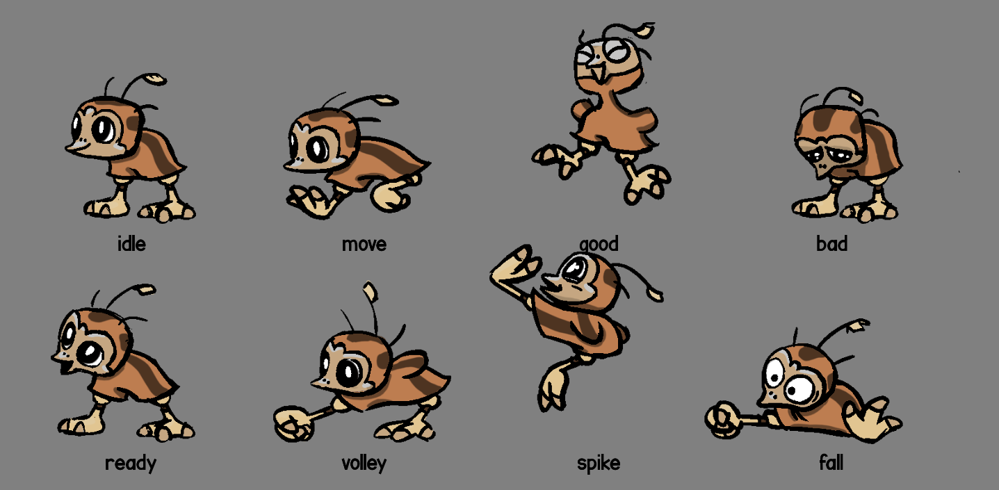
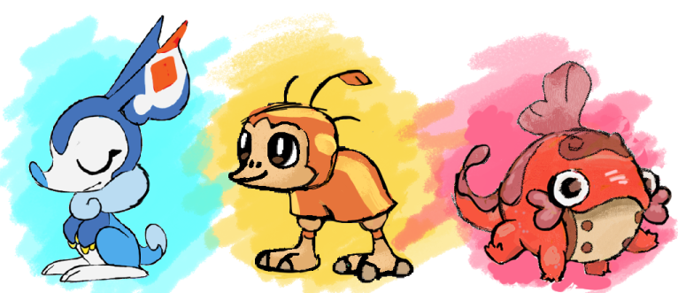
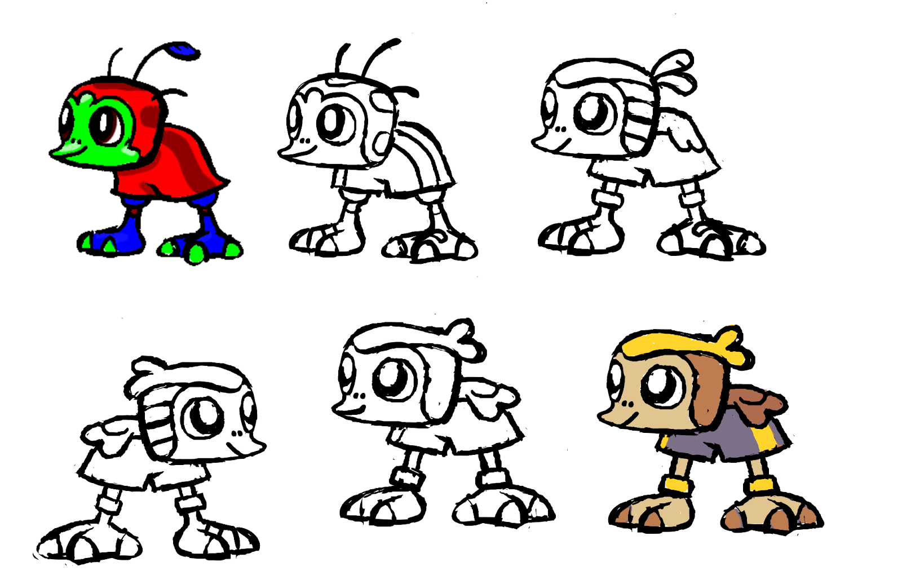

+++
title = "Behind the Scenes: Designing Kichik!"
slug = "behind-the-scenes-designing-kichik"
description = ""
[taxonomies]
tags = ["archived","beastieball"]
+++

This week we’re here to talk about Kichik, the body-focused emu chick monster athlete from Beastieball. Beastieball’s Kickstarter campaign is now in its final two weeks (!!!) with just a handful of remaining stretch goals to hit. If you’re excited about sports monsters and/or want to get your hands on some of the exclusive items we made for this campaign, then now’s the time…!

<a class="button primary" href="http://beastieballgame.com">Support us on KICKSTARTER!</a>
<figure></figure>
Unlike the other starters, Kichik was mostly designed just by Alexis, our Beastie director and animator. Alexis always has a hand in every design, but many are driven just by her - like this one, which was a bit special for her.
<figure></figure>
<strong>Alexis:</strong> I had always planned to do some sort of strong-legged flightless bird beastie, though I wasn’t sure exactly what their theme was going to be, other than the vague direction of ‘strong legs, kicks ball, big feet’. I started trying to cartoon an emu chick, figuring out what to emphasize, and thinking about how it would move and hit a ball. I kind of love the big-floppy-wings version, but it felt like they were getting in the way of their legs, and making them feel very duck-like.

<strong>Greg: </strong>The game starts by having the player choose their first Beastie from a set of 3 -<strong> </strong>this is something Pokemon does too, and it’s frankly good game design that we couldn’t improve on. You want players to choose their own Beasties so that they feel a personal connection to them; and 3 is the perfect number of choices (just enough to have a “favorite”, but just few enough to not be paralyzing). So before even a single design was done, we knew we needed 3 “starter” Beasties at some point. Once I saw these sketches, they seemed like a natural choice as a “starter Beastie” since they perfectly encapsulate the “sports + animals” theme of the entire game - most designs get a lot more loose with that premise.&nbsp;

<strong>Alexis: </strong>These were all done (I think?) before we’d brought other concept artists on board, so I was very much still figuring out what constituted a beastie! It’s hard to know when a design is done at the best of times, and harder when you don’t have much to compare it to. These are still rough drawings, but even considering that, they look a little underbaked in hindsight!
<figure></figure>
<strong>Alexis: </strong>I had originally been going for sort of a kids’ soccer team outfit, with a shorts-like body shape and a vertical stripe along the side. The feather on the head is a nod to a theme that appears in their grown-up form, which… To be frank, doesn’t really come across, even if you know what that form is haha! I felt like it wasn’t quite finished, but wasn’t sure where to go with it, so I stopped looking at it for a while and focused on other designs.
<figure></figure>
<strong>Alexis: </strong>Once we had Axolati finished and Bildit started, I had a good basis for comparison! …..aaaaand it was pretty clear right away that Kichik needed stronger shapes, simpler and more decisive details, and a clearer indication of their theming! And maybe a little more colour.

<strong>Greg:</strong> Making the stripes yellow here was my idea! We had established a color theme of blue, pink and yellow for the key types in the game (Mind, Spirit, Body) and I wanted to highlight Kichik’s focus with the colors more. Alexis has a tendency to make every creature brown or gray because she prefers naturalistic colors, whereas I’m all about oversaturated neons. Somewhere between our preferences is a happy medium.
<figure></figure>
<strong>Alexis: </strong>I liked the personality of the original design, so I tried to iterate on the shapes and proportions while keeping that feeling the same. I made the shorts a lot more obvious, moved their leg detail down so it didn’t break up the shorts’ silhouette, brought the wings back in a simpler form, and simplified their head feathers to match the scale and shape of the wing feathers. Feet got a lot bigger, and generally speaking I tried to make them look just a tiny bit more grown-up, as the previous version felt very babylike alongside the others.

<strong>Greg: </strong>Because they’re a starter, many decisions are made specifically to make them stand out next to the other 2 creatures. So with Axolati being such a perfect round circle, we decided to make Kichik more square-like and the last one more triangular. It helped us hone in on what made each one unique - squaring off Kichik’s shapes made them feel more strong and solid.
<figure></figure>
<strong>Alexis: </strong>I definitely have a tendency to lean towards more organic animal shapes and colours when designing a creature. This game is giving me a lot of opportunities to recognize that, and to try to push myself towards stronger shape language and bolder decisions!

<strong>Greg:</strong> It’s amazing how, even with a simple design, there are so many subtle considerations!
<figure></figure>
See you next time, where we’ll talk about designing everyone’s favorite blue bilby, Bildit!
