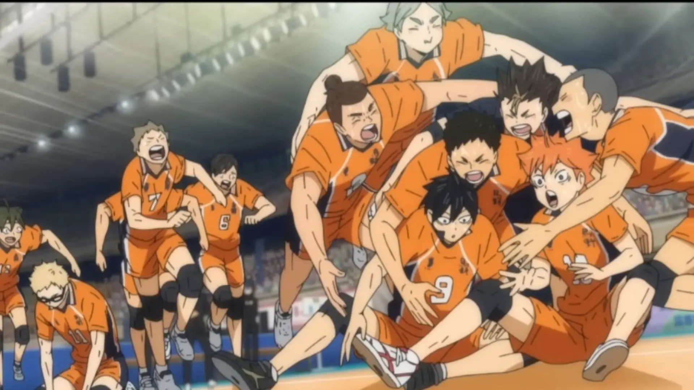
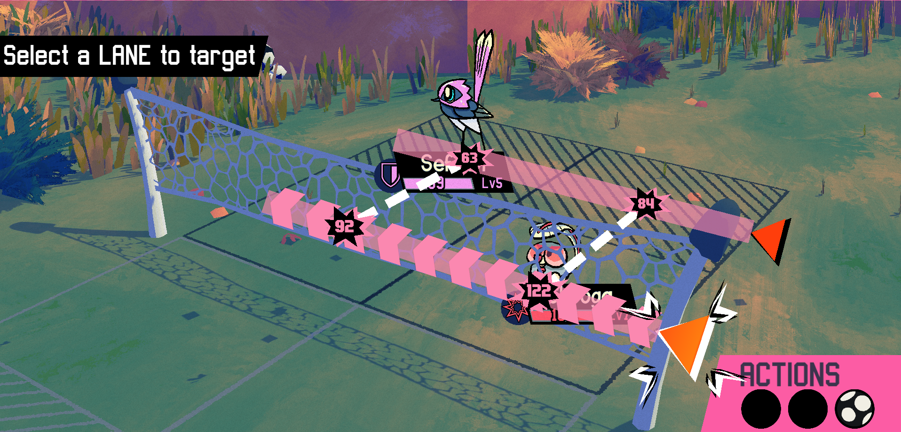

+++
title = "Designing Turn-based Volleyball for Beastieball"
slug = "designing-turn-based-volleyball-for"
description = ""
[taxonomies]
tags = ["archived","beastieball","musings"]
+++

Hello! I took a bit of a break from writing devlogs after funding our Kickstarter. We’ve been having fun diving back into Beastieball with newfound energy after finally revealing it and seeing all the love pour out :)

I’ve been holding a lot of thoughts about this game close to my chest for a long time. So many that it’s a bit daunting to actually sit down and try to unpack it all for a newsletter now! But, I think it’s time I talked a little bit about what inspired its unique turn-based volleyball system design. Many details really won’t make sense to dive into until the full game is available, and others still won’t all fit into one brief newsletter. This is a topic I’m passionate about and I expect I’ll return to it in future newsletters.
<h2>Why Turn-Based?</h2>
I’ve wanted to make a game about “building a team” for a LONG time; it’s a seed that I’d been cultiviating for nearly 10 years, slowly working out the practical details of how to build the game I was dreaming of.

One of the fundamental themes of “building a team” comes from learning about and deeply understanding each of the team members so that you can get the most out of their potential as individuals and in combination. Player’s success in my dream game had to be based on them forming this kind of understandning.
<figure><figcaption><em>Screenshot from Nintendo Switch Sports</em></figcaption></figure>
In any typical sports or action game, success is based on player reflexes, and you always overcome challenges by “getting good” and mastering the action, physics or controls better. Even in games that combine action elements with RPG elements, like Dark Souls, or active-turn-based RPGs like <em>Superstar Saga</em> or <em>Super Mario RPG, </em>there’s a sort of friction; after losing to a difficult boss, you’re often caught between trying again with your current equipment and just playing a bit better, or backing off and grinding for a bit to get a statistical edge. These games are hugely popular and engaging, but I came to understand that in my game I wanted none of this friction. Success and failure had to come down to your understanding of your team, and how well you strategized around them. And so the game <em>had</em> to be turn-based!

I had figured out this much, but was stuck there in my thinking for a long time, because I couldn’t decide what turn-based thing I wanted the team to <em>do. </em>Obviously there are lots of turn-based war and battle games out there and it would have been easy enough to make another one of those, but I wanted to challenge myself to explore new directions, if only to make something more creatively stimulating for me.
<figure><figcaption>Haikyuu</figcaption></figure>
I couldn’t figure it out until I saw the anime <em>Haikyuu</em> in 2020, which pretty much wrapped together all the themes of teamwork and personality chemistry that I’d been trying to synthesize in my head. And perhaps most importantly, it showed me that volleyball is an inherently turn-based sport, with each side equally trading control of the ball. Suddenly my idea for a team-building RPG was starting to make sense.
<h2>Mind Games</h2>
At this point I had an explosion of ideas and I was rapidly prototyping game designs. There were hundreds of decisions made about Beastieball around this time and I’d like to examine more of them in future articles, but for now I want to highlight one innovation that became a key feature for this game.

It started from thinking about what the essense of strategy is in the context of sports. Obviously there is the larger game plan; each player on a sports team has a specialty, ie. one player might be the designated point scorer and one might be there to play defense or disrupt the opponents. But in the micro, reflex, moment-to-moment decision making, it all comes down to mind games. If you can anticipate the very next thing your opponent will do, then you can move to block that choice and get an advantage; like making a block in volleyball, or intercepting a pass in basketball or soccer. High-level sports is not just about who is faster or stronger, but how effective you are at misdrecting your opponent and being able to move in a way they can’t anticipate or react to. I would say fighting games are best known for isolating and elevating this aspect of competitive games. I was interested in finding a way to make this part of the very DNA of Beastieball, giving players an opportunity to call out what their opponent will do, or misdirect them, to gain a statistical advantage.
<figure></figure>
This was the basis for the lane-based targetting system. Rather than targetting an opponent, you hit the ball across a lane or row of the field, and the attack is received by the first Beastie standing in the ball’s path. Beastie’s field position has an impact on their power and defense, too; Beasties at the net do boosted damage but take extra damage, too. Altogether it adds just a tiny bit of complexity and ambiguity, enough to create space for mind games.

While you prepare you offense, the opponent always has the chance to take a defensive action which is revealed right before the attack lands. This creates opportunities for the opponent to swap out who is on the field, or reposition their board to change the outcome of the attack. Similarly, as the attacker, you’re trying to anticipate what the opponent might do to defend, and often it ends up being “better” to pick a “worse” attacking lane that your opponent is less likely to predict and defend against. 

The sports-like format of the game is limiting in some ways, because the pace of the game is so tightly constrained; exactly ONE attack is made every turn, no more, no less. This is different from other strategy games where you might have some turns where you stall out and build resources, and other turns where you attack from multiple fronts simultaeously. I tried to lean into this weird property of the game and turn it into a strength, by making every attack interaction have a bit of build-up and surprise factor to it. 

This is probably enough from me for now. If you haven’t played the demo on Steam and are curious to learn more about the specifics of the sport systems, we made this helpful explainer video that shows a little bit more of it.

<iframe src="https://www.youtube-nocookie.com/embed/2ZRNHqqdx8w?rel=0&amp;autoplay=0&amp;showinfo=0&amp;enablejsapi=0" frameborder="0" loading="lazy" gesture="media" allow="autoplay; fullscreen" allowautoplay="true" allowfullscreen="true" width="728" height="409"></iframe>

I’ll see you in the next newsletter! 
