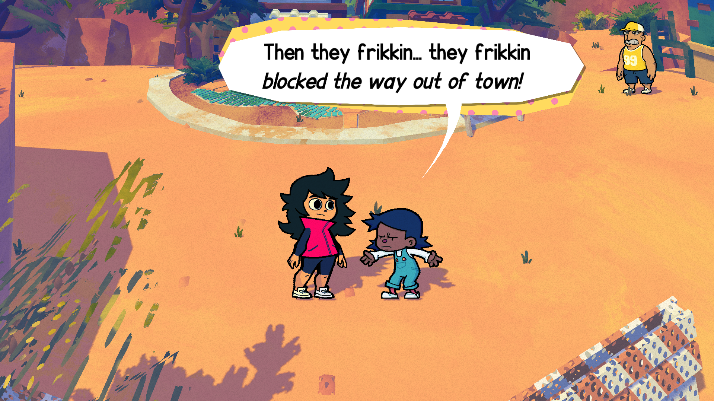
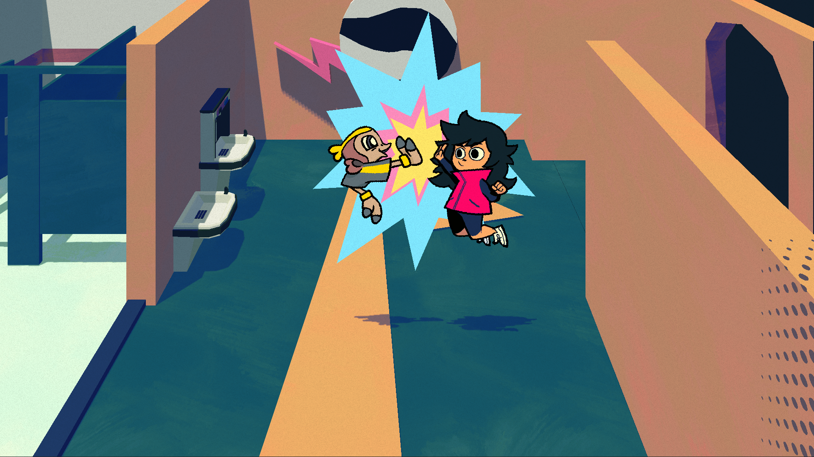
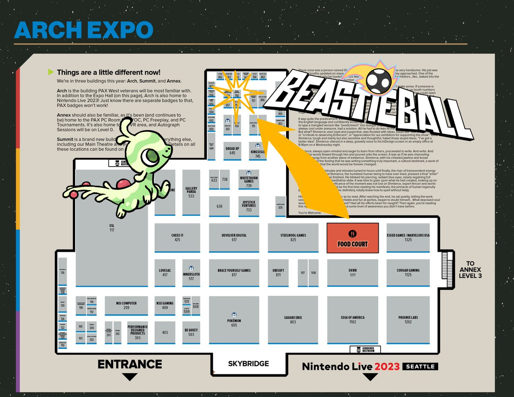

+++
title = "Introducing our redesigned characters! (+PAX West)"
slug = "introducing-our-redesigned-characters"
description = ""
[taxonomies]
tags = ["archived",]
+++

Hello! Exciting update today - following our Kickstarter, we have been working with a new human character artist! Her name is Chloe Ezra, formerly the character design lead at Brace Yourself Games (Rift of the Necrodancer, and other titles…)

Check out some shots of some of the updated characters:
<figure></figure>
Our goal with the redesign was to maintain the game’s weird, goofy shapes and character vibes but also make it more graphic and clean. Up until now I have been the sole person in charge of all the human character art and animation… on top the game direction, programming, design, writing, et cetera… and with the rest of the game coming along so well visually, I was definitely starting to feel that I was not giving the character art all the time and energy it deserved. We couldn’t be happier with how the new characters are turning out. We hope you love them too!

In other news, the team is going to be at PAX West this year! Feel free to come find us at booth #758, helpfully identified in this map:
<figure></figure>
We’ll be there ourselves to say hi and chat! We’ll also have an updated demo with the new character art - and possibly other surprises?? Hope to see you there!

-Greg
