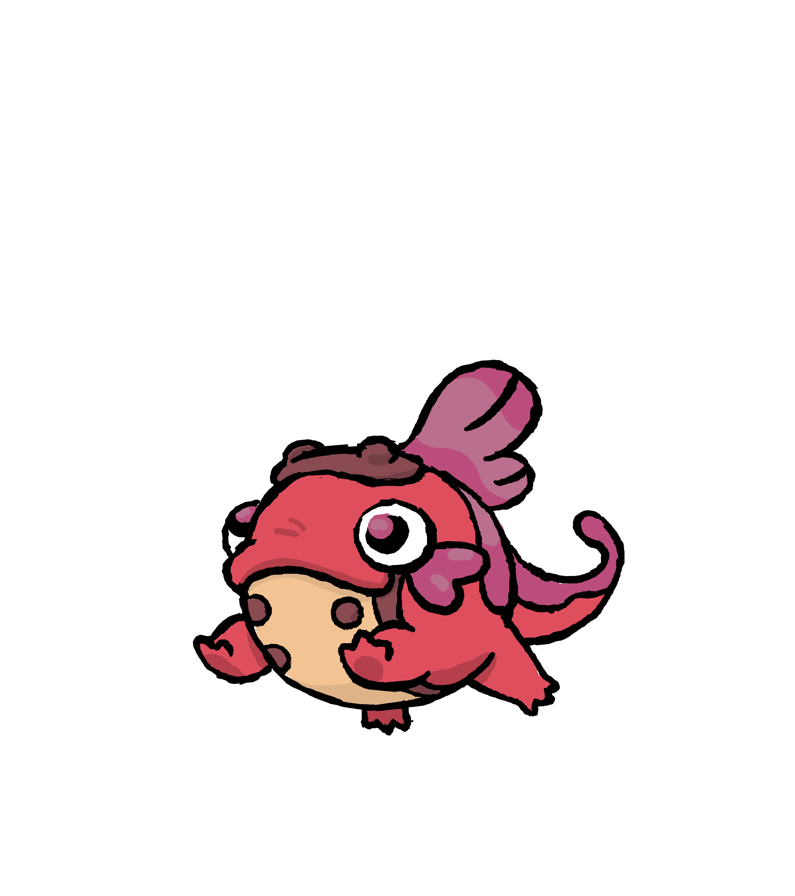
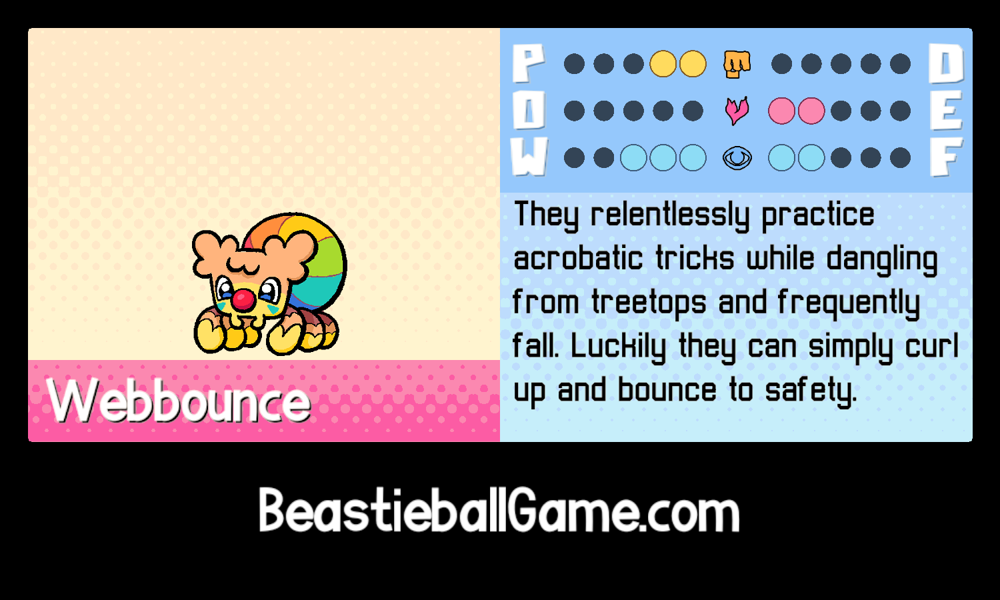
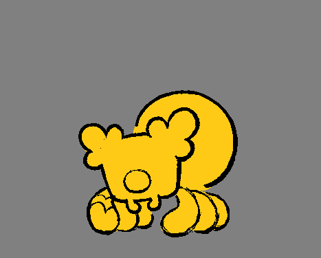

+++
title = "A new Beastie! + Starter popularity results"
slug = "a-new-beastie-starter-popularity"
description = ""
[taxonomies]
tags = ["archived","beastieball"]
+++

We’re back from PAX West 2023! We had an amazing show - thank you to fans who came out, and to all the new players who took the time to try our demo out :)
<figure><figcaption>We had standing cutouts of some of our favorite Beasties there - and we even got these amazing fan drawings from a couple talented fans who swung by the booth too. We adore them!!!</figcaption></figure>

<figure><figcaption>Right before the show ended, someone came up with a blank board and a set of copics and asked Alexis to draw something on it.</figcaption></figure><h2>Starter Popularity Results</h2>
The demo we brought was quietly tracking how many times each starter was chosen - mostly to satisfy our own curiosity, lol. I’m excited to announce the final results from 393 demo sessions played at PAX!
<figure></figure><ul><li>
In third place was <strong>Kichik</strong>, with 106 players - roughly <strong>27%</strong>
</li><li>
Second was <strong>Bildit</strong>, with 142 players - <strong>36%</strong>
</li><li>
The number one choice was <strong>Axolati</strong>, with 145 players (!) - <strong>37%!!!</strong>
</li></ul>
The ratio of selections was more even than I anticipated! And as a personal Axolati enjoyer, I’m happy to see them come out as number one against Bildit, who generally gets all the hype online. Although I’m not usually big into tracking stats, I’m starting to want to track some stats like these for the actual game release… it’s just fun to know.
<h2>New Beastie Data</h2>
Eagle-eyed <a href="https://discord.gg/BCrVZQNfwu">Discord members</a> noticed that some items we had at the booth were previously unrevealed. One of which was the Beastiepedia entry and stats for Servace - here they are!
<figure></figure>
Servace also has a unique trait called <strong>Spiker</strong> that makes their attacks from the net 20% stronger. This stacks with the universal net attack bonus, making them a HUGE offensive threat! But their low defensive stats can also make them a liability - coaches who want to make the best of Servace will have to learn how to mitigate the inherent risks of their playstyle.

And we’ve got one more NEW Beastie to reveal details on!
<figure></figure>
Webbounce, the jumping clown spider! Right when we started making this game, for some reason, I <em>really</em> wanted to do a clown bug. Alexis was vehemently against it, but eventually I was able to make it happen when we recruited Harlow Diggs to the concept team, a fellow clown bug enjoyer who successfully changed Alexis’ mind with their adorable designs. Like many other Beasties, we actually started by designing their mature post-metamorphosis form… I’m excited for players to discover that one someday.

Webbounce has a few unique plays and traits, but for now I’ll reveal just one- their <strong>Plucky</strong> trait which makes it so that they can’t be given FEELINGs by other Beasties (our version of status effects). They aren’t the most powerful Beastie stats-wise, but their feelings immunity makes them very difficult to impede. No matter what the other team throws at them, you can count on them to get the job done!
<figure></figure>
We’re still working on their animation, but I thought it would be fun to share the work-in-progress. It’s hard to appreciate how much work and how many drawings go into making each Beastie when you only see the clean, finished product… but you can also appreciate how their personality and charm comes through even in these early stages.

Now that we’re home, I’m excited to dive back into development! I’ve been drafting out the final challenges in the game and having a blast seeing it all come together. 

See you in the next newsletter :)
<figure></figure>