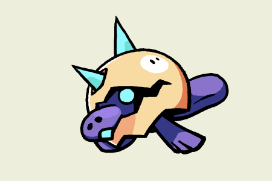

+++
title = "Introducing Platenna, the electroreceptive Beastie!"
slug = "introducing-platenna-the-electroreceptive"
description = ""
[taxonomies]
tags = ["archived","beastieball"]
+++

We’ve got a brand new Beastie to show off today!
<figure><figcaption>Platenna: They use their bill to detect electrical fields. They rely heavily on this sense while the rest of their body develops.</figcaption></figure>
Platenna is a quintessential Mind-focused Beastie. Their unique trait, Neural Net, makes it so that all Mind-type attacks that target their side of the field automatically go straight to Platenna! This means your opponent can’t use Mind attacks to score a free point, nor to harm their ally. On the other hand, even when Platenna is low on stamina, you can’t stop your opponent from hitting them with any Mind attack no matter what you do…
<figure><figcaption>Concept art by Karen Centella Sánchez and Tia 'TK' Rohrer!</figcaption></figure>
Platenna was first conceived by <a href="https://twitter.com/HABANNIRO">@HABANIRRO</a> and the design was then polished off by <a href="https://twitter.com/Irischroma">@Irischroma</a>. They were inspired by the very real ability of the platypus to detect the movement of prey by changes in their electrical field (which is… awesome?!?!?!).
<figure><figcaption>Look at her go!</figcaption></figure>
The final animation you’re seeing here was done by <a href="http://cohost.org/mikejwitz">Mike Horowitz</a>, who joined our team this month as a full-time animator! He’s got a great attention to detail and an extraordinary way of capturing the little personalities of each Beastie. His amazing work on Platenna already has us excited to see more!

We’re at a point in the project where ~95% of all the Beasties have a finished design, concept, stats, traits, plays etc. (!!!). But there’s still a ton of work remaining to get all of that art cleaned up and animated for players to appreciate. Thanks to Mike we’ll be able to speed up that process a bit, which hopefully means more cool creatures that we can show off to you in the coming months. :) 

See you next time!

-Greg &amp; The Beastie Team
