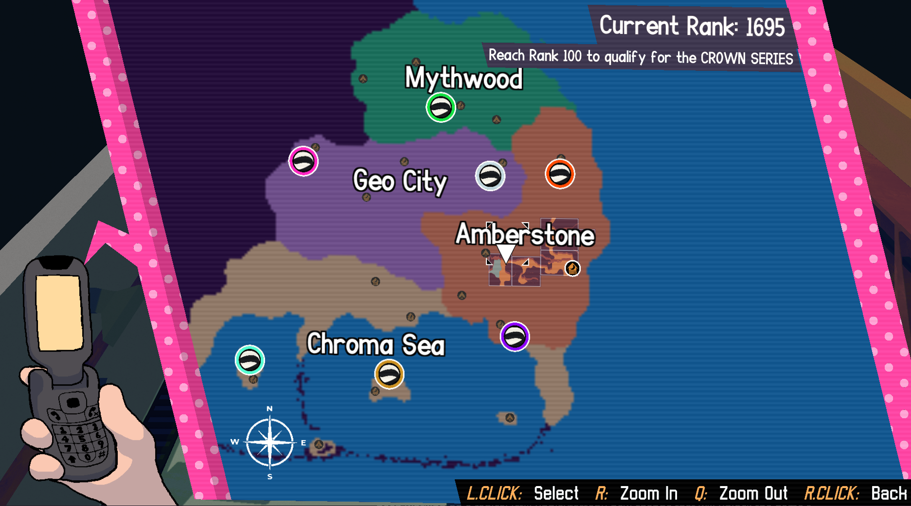

+++
title = "Demo update! (& design updates)"
slug = "demo-update-and-design-updates"
description = ""
[taxonomies]
tags = ["archived",]
+++

Surprise! In celebration of Steam’s Next Fest this week, we’ve updated our demo. There’s no significant new content <em>(we’re keeping it all secret!)</em> but there’s a few nifty new features including expanded character customization, a run button, new character art, and more! 

Especially if you haven’t played the demo yet, now’s the perfect time - your save data will carry over to the full game release!

<a class="button primary" href="https://store.steampowered.com/app/1864950/Beastieball/">Check out the demo here!</a>
<figure></figure>
<em>(Note that the demo is updated on Windows only - the Mac version will be updated later this week.)</em>

It’s a relief to have the demo up to date, although 99% of the work we’ve been doing on the game is invisible in this tiny slice. We’ll be working hard this year to get the whole thing ready so that everyone can finally play it - wish us luck!
<h2>Development Update</h2>
In our last couple updates we shared that the game was beatable and that we’d seen players taking about 25 hours on average to play through the main story. Part of me was excited by this figure - that’s an impressive amount of game for a team as small as ours to have made! But after I sat with it for longer and considered what I’d seen in playthroughs, it bothered me to see how easily players were sinking time into it.

I’ve learned it’s a delicate balance with turn-based RPGs like this. Unlike, say, a platformer or puzzle game where every inch of the game world is crafted and is, itself, the “experience” - in an RPG the game world can essentially be reduced to a container for turn-based encounters. It’s easy for a game’s playtime to balloon out of control if you get into a habit of stuffing mandatory encounters everywhere, or put players into mazes that effectively make them walk in circles and repeat the same encounters many times. Basically: I underestimated how much the game can slow down when players aren’t doing just what’s absolutely mandatory. Especially because of the game’s open-ended nature, I worried that the story dragged, because in some cases players would (partly by accident, partly by willful procrastination) sometimes fool around exploring for hours in between major story beats, especially in the back half of the game where your levels are high enough to get anywhere easily and the map really opens up.
<figure></figure>
So: in addition to a lot of new story content and side things I’ve been working on, I’ve been working on a radical (still unplaytested!) new change that will unlock the game’s ending much earlier on than before, effectively turning a massive portion of the previously-mandatory areas into optional or post-game content. My aim is to bring average completion times down lower while preserving all the key story. It feels like a risky change to make, knowing that completion times are often used as a shorthand for how “big” the game is and may make the game seem less valuable to prospective players… but I’m optimistic that players will respond positively to something that feels absolutely packed with ideas and ends before it overstays its welcome. (And just to be clear, nothing is getting cut… it just means that if you go for the ending earlier, you’ll have that much more to check out in the postgame).

I don’t know if I mentioned this on the newsletter before, but really it was sort of an accident that this game became an RPG in the first place - my foremost goal was to make a game about team-building and relationships, which led me to decide on turn-based strategy that highlighted each character’s unique parameters, and from that came the idea to represent characters as diverse little monsters that level up as you spend time with them, and with THAT came all the default baggage that comes with turn-based RPGs. My design process throughout this project has largely been a personal reexamination of what I like about RPGs, what I don’t like, and how many parts I didn’t think I liked were actually necessary structural pieces that hold the whole thing together. This is the 3rd full-scale RPG I’ve made, but I still feel like I have so much to learn. I could go on about this subject forever… Maybe in another newsletter! I’ve gone on long enough!

Thanks for reading. It feels unprofessional to harp on about the things I’m still struggling with in the design sometimes, but it’s also nice to get to share these tidbits about the process. My focus remains on making an absolutely amazing video game that you’ll get to play in 2024!
