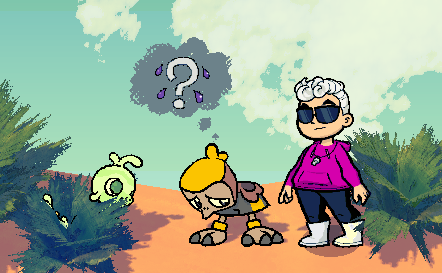
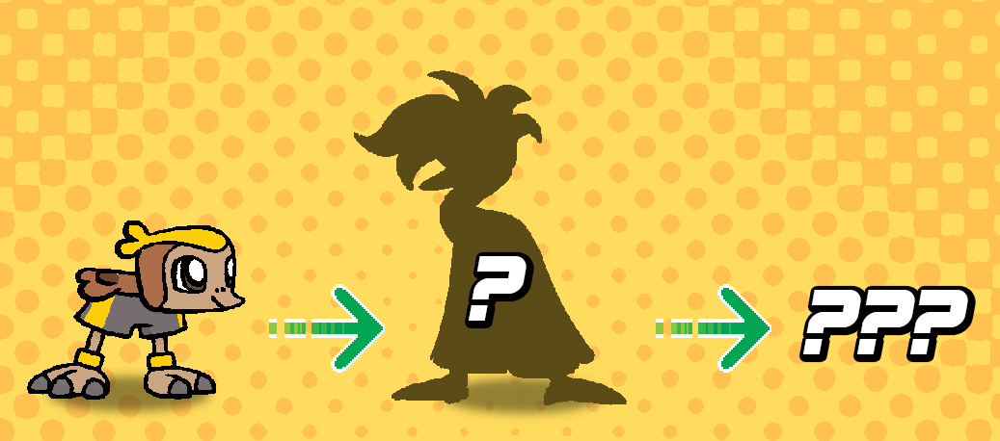

+++
title = "A Field Guide to Beastie Metamorphosis"
slug = "a-field-guide-to-beastie-metamorphosis"
description = "Featuring some sneak previews..."
[taxonomies]
tags = ["archived","beastieball"]
+++

Before you read this newsletter, a <em><strong>SPOILER WARNING</strong></em> might be warranted! We’re going to show a small preview of what your starting Beasties could become during your adventure. There will still be plenty of mystery remaining, but if you’d rather not know <em>ANYTHING</em> about what awaits you on your journey, then stop reading this newsletter right now!!!

<figure></figure>
As you journey with Beasties, you might one day find that one <strong>feels strange</strong><em>. </em>They’ll start to sweat constantly, and they’ll struggle a bit more in sports matches. The good news is that this is nothing to worry about! It means their body is working through some big changes. If you help them push through the discomfort, you’ll get to witness the miracle of <strong>Beastie metamorphosis</strong>!
<figure></figure>
In their natural habitat, Beasties will tend to play with others of their own kind, and their physical adaptations reflect the environment they originate from. But by journeying with a coach, visiting new environments and training with diverse allies and opponents, they’ll learn new skills and grow rapidly. Beasties metamorph so they can meet the greater demands that come from high level Beastieball! At least, that’s what we think.
<figure></figure>
When Beasties metamorph, it’s not just a physical change - their personalities will grow and develop too. This can change how they relate to other Beasties and how their relationships develop, too! 
<figure></figure>
Not every Beastie is capable of metamorphosis. Conversely, some are capable of multiple stages of metamorphosis. The 3 Beasties you meet at the start of the game all fall in that category. More rarely, some Beasties have branching lines of metamorphosis and are capable of becoming different species depending on different factors. Beastie metamorphosis is a vast mystery! There are almost certainly more hidden facets still waiting to be discovered…
<figure></figure>
That’s all for now! Next time we’ll be back with another new Beastie to show!

