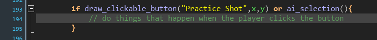

+++
title = "How AI works in Beastieball"
slug = "how-ai-works-in-beastieball"
description = ""
[taxonomies]
tags = ["archived","beastieball"]
+++

With this newsletter I generally try to stick to broad concepts, but this post will be a bit more technical and specific. It’s something I’ve been excited to write a bit about!
<h2>Update and Render</h2>
To explain the first and weirdest detail of how the AI is written, I need to briefly explain how games are generally programmed. Essentially, you break every step of the computing process into two main phases - updating the game state, and then rendering that state to the user.
<figure></figure>
But Beastieball’s “battle” system works like this.
<figure></figure>
The code which renders and displays all of the clickable buttons that the player uses to select their actions ALSO contains the logic for clicking on them and what that does (advancing the game state, queuing turn-based actions, etc), and it ALSO contains all of the logic that the AI uses to make decisions.
<figure></figure>
Here’s an example of what the code for these clickable buttons might look like:
<figure></figure>
Doing the logic for clicking on buttons at the same time as you render them isn’t too-too weird in the grand scheme. It’s nice that you can re-use the on-screen render bounds for box to also detect when the user’s selector is overlapping that box to click on it. But throwing the AI into there as well is not something I’ve even seen someone talk about before.
<h2>The AI Decision Tree</h2>
The way the AI basically works is: Each step, it will run the game UI render code as if it were going to render the UI to the player, but rendering is disabled so nothing new actually appears onscreen. Instead, at the end of the UI render attempt, the AI has a list of all the clickable areas that were rendered. Then it runs the UI render again, but this time it “clicks” on one of the clickable areas, advancing the game state as if a player had clicked on a button there. 

It does this until it has nothing left to click on, then evaluates the “Board Score.” This means assigning a value to how favorable the current game state looks to them. Since each button click also advances the game state, each “run out of clicks” state represents a unique possible outcome for the AI’s turn after all their actions are used. The AI will treat the state as more favorable if, for example, they’re launching an attack that is likely to do more damage, or their team status is healthier.
<figure><figcaption>Typical path the AI will take on its first pass.</figcaption></figure>
The AI then goes back to the start of their turn and starts over, repeating this process ad nauseam until it has clicked on everything it could ever click in every situation, and has assigned a score to all possibilities.
<figure></figure>
From there, the AI goes back to the top one more time, picks out the route that scored the highest, and then clicks on those things in that order, this time actually committing to the choice and playing it out in a way that the player can see. Aside from having the AI hooked up the game’s render loop, all of this procedure is actually fairly standard. If you’re interested in learning more about how AI decision trees work, there are some <a href="https://www.youtube.com/watch?v=U4ogK0MIzqk">great entertaining YouTube videos out there on the subject.</a>
<h2>Why is it like this</h2>
In the context of Beastieball, I think it’s worth noting how every aspect of this procedure makes it super easy to develop new features.

Firstly, the “Board Score” evaluation is a really flexible and powerful tool. AI for different encounters can be given interesting unique behaviour by adjusting how it values certain things. For example, in our <a href="https://store.steampowered.com/app/1864950/Beastieball/">Steam demo’s</a> “Boss fight” against Marlin, he wants to teach you about attacking empty lanes, and so intentionally leaves certain lanes open - we achieved this by assigning a negative value to lane defense in his AI. 

But the coolest, most “magical” quality of this system is that the AI has full access to everything the player does, automatically, with no extra effort on the part of the programmer(s) or designer(s) (me). This was critical when I was in the early phases of prototyping this game, and was frequently adding, moving or deleting features from the system trying to figure out a good design for turn-based volleyball. 

That quality continues to be valuable even as development has progressed. About a week before we first revealed our Steam demo, I made a very big change to the game systems, adding a new “Block” move that any Beastie could do at the net. Simply by adding the button to the player’s interface, the AI also had access to it, and even started using it in unexpectedly optimal ways that helped me quickly test and refine the idea before releasing it.

There are a lot of hidden benefits to testing and balancing the game that were unlocked by having the AI so closely tied to player behaviour, which I’d love to cover in greater detail another time. But suffice to say that the ease of adding new features and move effects and getting to see them played out instantly has been immensely valuable to this project!

See you in the next newsletter.
