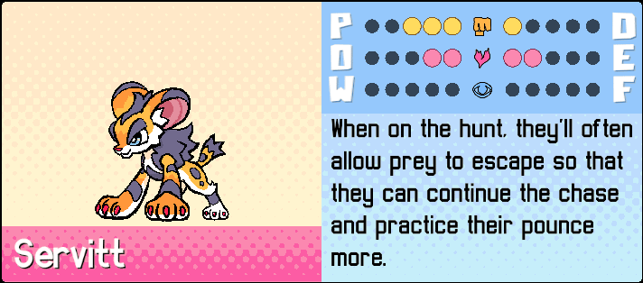
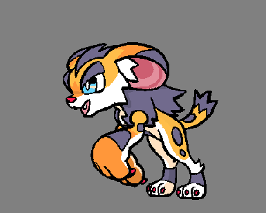

+++
title = "Servitt, the sporty serval Beastie!"
slug = "servitt-the-sporty-serval-beastie"
description = ""
[taxonomies]
tags = ["archived","beastieball"]
+++

There are all kinds of Beasties out there who specialize in all kinds of playstyles. Some leverage unique traits and game mechanics to change the flow of the match. Some have access to tricky techniques to mess with the field or their opponents. And some just like to hit the ball really, really, really hard.
<figure></figure>
Look familiar? Servitt is the juvenile form of Servace, the ace spiker Beastie!
<figure></figure>
These Beasties are all about damage output. Their unique trait, <strong>Spiker,</strong> gives their attacks from the net an additional 20% power boost. This stacks on top of the natural 50% power boost all Beasties get at the net to make their attacks extra devastating. 
<figure><figcaption>Whoever they hit, it’s gonna hurt.</figcaption></figure>
But all that power comes with some risks. For one, Servitt and Servace’s playstyles are pretty linear: if you see one on the field, you pretty much know the only thing they can do is rush the net and hit. Secondly, their defenses are brittle, and that’s only magnified by the vulnerability that all Beasties have when standing at the front. Players who want to mitigate their weaknesses might want to shore up their defense with a tanky partner who can redirect attacks; or perhaps a teammate who can support Servitt’s damage so they win in just one shot. You could even consider throwing down a second attacking Beastie who lets Servitt steal the attention of the enemy defense to sneak in an unexpected attack. However you use Servitt, their presence on the field exerts indomitable pressure on the other team.
<figure></figure>
This Beastie’s spread of stats, trait and plays was one of the very first I implemented when I first started testing out the game systems, before we had even a single creature designed. Their playstyle was inspired by - who else? - Hinata from the volleyball sports anime/manga, <em>Haikyuu</em>. It wasn’t until much later, and through much iteration, that <a href="https://twitter.com/Irischroma">Tia Rohrer</a> put such a cool and cute face to them, and Mike Horowitz animated them.
<figure></figure>
See you in the next newsletter!
