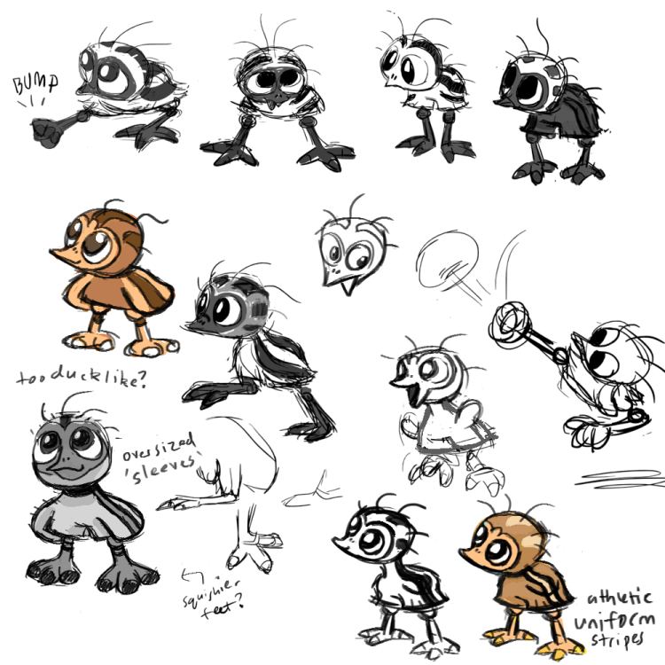

+++
title = "All About Beastie Types"
slug = "all-about-beastie-types"
description = ""
[taxonomies]
tags = ["archived",]
+++

In today’s newsletter, I wanted to talk about some of the considerations we take when designing new Beastie concepts!

This info is taken directly from our actual style guide which we gave to concept artists when we started working together. Originally I wanted to share the entire style guide, but it’s pretty long and dense and full of spoilers. It might be fun to put the whole thing in an artbook someday… but until then, here’s the details just on Beastie types!

Unlike in other monster games, Beasties do NOT have a strict “type.” Instead they’re measured by their strength or weakness in the categories of <strong>Body,</strong> <strong>Spirit and Mind.</strong> Each Beastie’s unique alignment to these 3 categories informs their match-ups in the game, but it also informs their personality and motivations as characters. 

There are lots of ways for a designer to take inspiration from the types. There is a careful balance to strike in how much each design should follow these themes vs. contradict them. Ultimately it’s more important for each Beastie to have a vibe that is unique to them rather than conform to a stereotype!
<h2>BODY</h2><figure><figcaption>Early Kichik concept art</figcaption></figure><ul><li>
Tend to have stronger bodies, ie. muscles, armor, or just be bigger in general
</li><li>
Could have exaggerated arms, legs, tail
</li><li>
Dexterity - good physical self control &amp; able to do impressive ball maneuvers like juggling, spinning, etc.
</li><li>
Associated more with the colors yellow/orange
</li><li>
Associated with vitality, healing, energy, exercise, sports, electricity/thunder
</li><li>
Balanced, consistent moves that don’t have obvious weaknesses or drawbacks
</li><li>
DnD stats: Strength, Dexterity
</li><li>
Beasties who are weak in Body power might be smaller or more frail.
</li><li>
Beasties who are weak in Body defense might have difficulty physically handling the ball, due to frailty or lack of dexterity.
</li></ul><h2>SPIRIT</h2><figure><figcaption>Axolati concept art</figcaption></figure><ul><li>
AKA “Heart,” these Beasties tend to be passionate, strong willed and determined
</li><li>
Compassionate, genuine, protects/cares for teammates
</li><li>
Associated more with the colors pink/red
</li><li>
Associated with fire, wind, music, voice, feelings, dance
</li><li>
Could have exaggerated features on their chest/back or have large/beautiful display features (flashy/vivid colours, form over function, etc)
</li><li>
Powerful moves with drastic costs/consequences
</li><li>
DnD stats: Constitution, Charisma
</li><li>
Beasties who are weak in Spirit power might be more apathetic, deceitful, or mean-spirited
</li><li>
Beasties who are weak in Spirit defense might be similar, or they might be <em>overly</em> emotional
</li></ul><h2>MIND</h2><figure><figcaption>Bildit concept art</figcaption></figure><ul><li>
Tend to be smart, calculating, clever, logical, cold
</li><li>
Associated more with the colors blue/violet
</li><li>
Associated with ice, water, illusion, anxiety, games, math, technology, the supernatural
</li><li>
Could be tricky, or even prankster-like
</li><li>
Could have exaggerated eyes, head, features that let them carefully manipulate the ball
</li><li>
May be more likely to have startle/warning displays (deimatic/aposematic)
</li><li>
Moves that are weaker but with powerful side effects/debilitating status effects
</li><li>
DnD stats: Wisdom, Intelligence
</li><li>
Beasties who are weak in Mind power might be more simple, honest, straightforward or less thoughtful in general.
</li><li>
Beasties who are weak in Mind defense might be less observant, more instinctive, or especially gullible/trusting
</li></ul>

So why did we resist making types that were more strictly defined, like in other monster games? Well, bluntly, everybody already knows about Pokemon types. Coming up with our own set of types, with different matchups, and asking players to memorize those feels like a lot to ask. And anyway, even if you switch around what the types are called and/or how they match up, the game won’t wind up feeling very different from what’s already out there. 
<figure></figure>
Our squishier “type” system does more to highlight each Beastie’s unique position along various spectrums, rather than simply being one thing or the other. This is more in line with our deeper goal to make Beasties feel more like living, autonomous beings. Because each type is broader in definition, it also means there’s way more overlap in what plays different Beasties learn, and that means there are far more opportunities for friendly Beasties to teach new plays to each another, which makes our relationship system feel more lively and interesting. Players who invest deeply in the game systems will be more likely to categorize Beasties though their individual roles and game mechanics, almost more like fighting game or MOBA characters. Altogether, it gives Beastieball a flavor that we’ve never quite seen before!

Still, I can’t deny the fun that types add to this game’s texture. I love media that offers fun and broad categories for their characters (for example, the 4 elements in <em>Avatar: The Last Airbender</em>). I also enjoy how they can be applied outside their original context. You can reason with questions like: what type is your favorite? Or, what type would YOU be? Ultimately, it’s just plain fun to be able to put things into categories, and “types” are a big, big way of doing that. 

See you in the next newsletter!

<h1></h1>