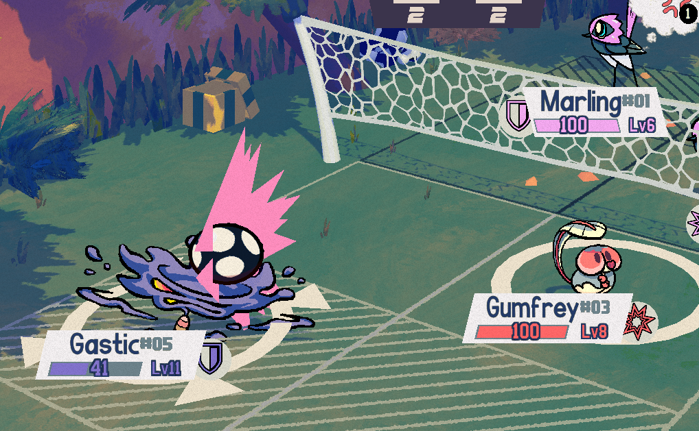

+++
title = "Gastic, the spooky gas bug!"
slug = "gastic-the-spooky-gas-bug"
description = ""
[taxonomies]
tags = ["archived",]
+++

For those courageous coaches who brave the Solanum Weald, they’ll be faced with some of the strangest Beasties we know of. It’s a twisted place where you can’t always trust what you see, thanks to the illusory work of this tiny Beastie!
<figure></figure>
Gastic in inspired by <a href="https://en.wikipedia.org/wiki/Bombardier_beetle">bombardier beetles</a>’ chemical spray ability, although taken to a ridiculous extreme. They’re able to control the shape and density of their gas to manipulate the ball and spike it! Do the other Beasties even realize they’re playing against a bug?
<figure><figcaption><em>It’s a struggle, but it works…</em></figcaption></figure>
Gastic has one of the most unique traits in the game; <strong>Intangible</strong>, which makes them <em>completely immune</em> to Body-type attacks. If you hit them with other attack types, they can be quite frail, but their immunity to Body makes them a terrifying counter to many of the sport’s strongest competitors. Combine that with their access to some devious Mind attacks and debilitating status effects and you’ve got yourself a tricky Beastie that can’t be ignored by any coach!
<figure></figure>
That’s all for now. See you in the next newsletter!
