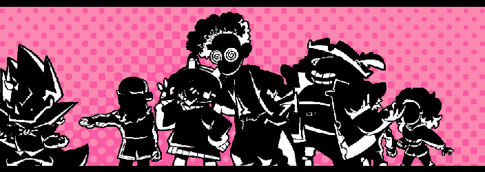

+++
title = "Revealing a Ranked Coach & New Boss Music"
slug = "revealing-a-ranked-coach-and-new"
description = ""
[taxonomies]
tags = ["archived","beastieball"]
+++
<figure></figure>
Right from the start of your Beastieball adventure, you can explore in any direction and take on any of the Ranked Coaches scattered across the map. Today we’re going to introduce one of them!
<figure></figure>
Meet <strong>Riven</strong>, coach of the <strong>Mythic Dreamers! </strong>She’s a restless creative whose head is always in the clouds, lost in her latest book project. Although writing was her first passion, her prodigious Beastieball skills got her appointed as her hometown’s head coach. She’s truly woman of many talents!

Riven focuses on <strong>Mind-type</strong> Beasties. Although Mind-focused Beasties are better known for their tricky tactics, she uses passes and type synergy to dish out strong boosted hits so she can quickly win the match and get back to her writing. Coaches who want to take her on should build a team with solid Mind defense!

We’re also excited to debut the music you’ll hear in your big match against her, composed by the legendary Lena Raine!

<iframe src="https://www.youtube-nocookie.com/embed/K0kWVoEUTN8?rel=0&amp;autoplay=0&amp;showinfo=0&amp;enablejsapi=0" frameborder="0" loading="lazy" gesture="media" allow="autoplay; fullscreen" allowautoplay="true" allowfullscreen="true" width="728" height="409"></iframe>

In case it wasn’t clear, many of the game’s bosses will have completely unique music when you challenge them. Look forward to hearing tons of different exciting boss themes like this over the course of your adventure later this year!
<figure></figure>
That’s all for now! We’ll see you in the next newsletter with an exciting announcement. :)
