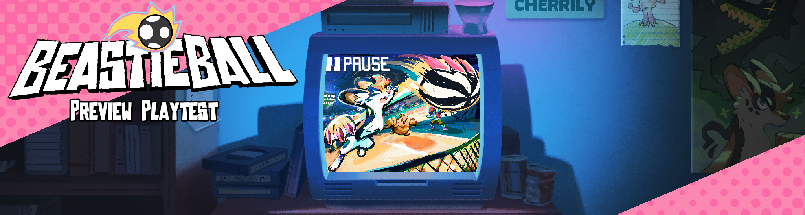

+++
title = "Announcing: Beastieball PREVIEW PLAYTEST"
slug = "announcing-beastieball-preview-playtest"
description = "Sign up for a preview of Beastieball on Steam!"
[taxonomies]
tags = ["archived",]
+++
<figure></figure>
Surprise! On <strong>June 10</strong>, we’re going to roll out our first official <strong>Preview Playtest!</strong> We’ll be giving select players access to the first major area of the game, including some story, boss fights, online features and other surprises…

If you want a chance to check out the game, be sure to sign up on our Steam page! 

<a class="button primary" href="https://store.steampowered.com/app/1864950/Beastieball/">Sign up for the Playtest HERE!</a>

<em>(Note that players will be randomly selected, so signing up does not guarantee that you’ll get access…)</em>

If you want more details on what this is and why we’re doing it, read on!
<h3>What is this?</h3>
We’re trying out Steam’s “playtest” feature, something we’ve seen many games do before. There will be a temporary version of the game available on Steam which includes the first major area of the adventure. Only a few select players will be able to play it, but there are no rules against recording, streaming etc. Signing up and playing is completely free.
<h3>Who will get to play?</h3>
Everybody who backed us on Kickstarter will be given a key that guarantees them playtest access (check for our latest <a href="https://www.kickstarter.com/projects/greglobanov/beastieball/posts">backer update</a>!). We’ll also send keys to a small selection of content creators. Other than that, anybody can sign up for the playtest on our Steam page. When the playtest goes live, we will randomly select players from the signups to get access to the playtest.
<h3>Why do a preview playtest?</h3>
This will provide us with super-valuable feedback and data. Beastieball is a very open-ended game with many different ways a player can choose to tackle it. We want to see a wider variety of players interacting with the game so that we can find obscure issues &amp; make sure it’s perfect before it goes out to the general public.

We also want to use this as a chance to show off more of the game and attract new players. :) We think unedited gameplay, and players’ honest impressions of it, will do more to demonstrate what’s great about this game than any trailer we can put together. Perhaps we’re over-confident, but we’re very excited to see people’s reactions to these early areas of the game… 
<h3>What about spoilers?</h3>
Although this playtest does have a substantial amount of content in it, it’s still only a small fraction of the entire experience we have in store. Also, because every player’s journey and team can be so unique, we’re less concerned with details of the game leaking. Watching someone else play will only highlight all the ways which your own adventure could differ!

Still, depending on your sensitivity to spoilers, you may or may not want to avoid content related to the playtest. Many new characters, areas and Beasties will debut, including the <a href="https://greglobanov.substack.com/p/a-field-guide-to-beastie-metamorphosis">second metamorphic forms</a> of the starter Beasties. Going forward, this newsletter and our social media will <em>NOT</em> assume that players have any familiarity with content from the playtest, and we’ll continue to release new details about the game at a slow and steady pace as if the playtests never happened. It’s totally up to you if you want to engage with it or not.
<h3>That’s all for now!</h3>
We’re very, very, very, very excited to pull the curtain back just a little bit more on this goofy sports adventure. If you have other questions for us, or want to follow reveals alongside the community, we recommend joining the official <a href="https://discord.gg/H7RcGbFNjZ">Wishes Unlimited Discord</a>! We hope to see you there.

