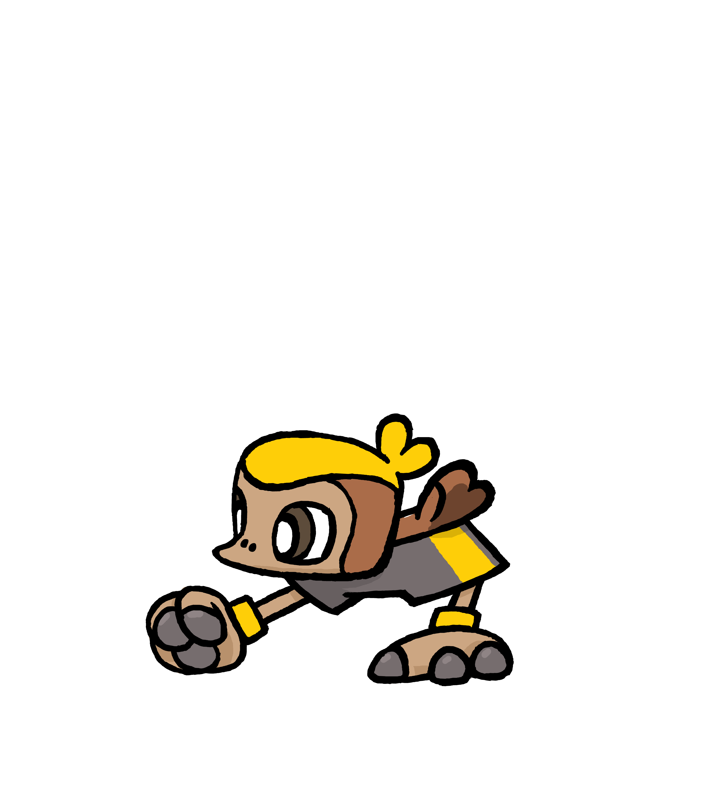

+++
title = "Playtest Results! Beastie popularity, fun data and more!"
slug = "playtest-results-beastie-popularity"
description = "Here are the stats from our first timed playtest! For nerds who like data"
[taxonomies]
tags = ["archived",]
+++
<h3>THANK YOU for playing the Beastieball Preview Playtest!</h3>
This has been an exhilarating and exhausting couple weeks for the team. We had high hopes that players would fall in love with the game after they got to play a bit more, but the overwhelmingly positive response floored us all the same. Thank you, thank you!

If you wanted to play but didn’t get in this time, don’t fret! <strong>There will be more playtests this year</strong> as we gear up for release. Watch here for updates on that!
<h2>By The Numbers</h2><ul><li>
<strong>669 unique players</strong> played the Playtest build. (Not everyone who was given access played the game). <em>Interestingly, an additional 670 unique players played the <a href="https://store.steampowered.com/app/1864950/Beastieball/">free Steam demo</a> in the same time period. I have no idea why those numbers are almost exactly the same. </em>An estimated 40% of our Playtesters were continuing a save they previously started in the Demo.
</li><li>
<strong>4,198 people</strong> <a href="https://store.steampowered.com/app/1864950/Beastieball/">wishlisted</a> the game during the playtest period. (Thank you!). During this time period Steam also ran their “Next fest” event and Klei ran their “Kleifest” event, which both likely drove some traffic to us.<em> However, we were not active participants in either event.</em>
</li><li>
<strong>4,786 Beasties</strong> were recruited by Playtesters!
</li><li>
<strong>1,316 feedback reports</strong> were sent to us from in-game!
</li><li>
<strong>1 developer</strong> is in charge of reading, prioritizing and addressing all those reports. He better finish this newsletter quick and get back to work, yipe!
</li></ul><h2>Starter Popularity</h2>
To get the most data possible, these results consolidate data from Demo players as well as Playtest players over the last couple weeks! 
<figure></figure><ul><li>
The #3 choice: Kichik, recruited by 177 players.
</li></ul><figure></figure><ul><li>
#2 was Axolati, recruited by 402 players!
</li></ul><figure></figure><ul><li>
And #1 was Bildit, recruited by 645 players! That’s 52.7% of the vote - Wow!
</li></ul>
Of course it’s only natural for one starter to rise to the top of popularity charts. That’s fine, though… it just means fans of the the other starters are more cool and unique. 😎
<h2>Social Bonds</h2><figure></figure>
One surprise feature we held back for the Playtest was the <strong>Contacts</strong> menu, where you can spend social batteries to hang out with other characters you meet along your adventure. We were pleased to see this system well-received by players so far :) But wait, who was the most popular friend?!
<ul><li>
#4 was Kaz, coach of the <strong>Raging Blazes</strong>, with 170 hangouts.
</li><li>
#3 was Riven, coach of the <strong>Mythic Dreamers</strong>, with 202 hangouts. Kaz and Riven both needed to be unlocked by playing against them, so it makes sense that they had a little less action.
</li><li>
#2 was Reese, with 236 hangouts.
</li><li>
And #1 by a landslide was Riley, with 328 hangouts! 
</li></ul><h2>And the Most Popular Beastie…</h2>
…Was recruited <strong>604 times! </strong>We actually haven’t ever officially revealed them before, but in honor of their win, it’s time you get to know them.
<figure><figcaption>Collarva: Their spines naturally collect plant detritus as they move about, building up their protective coat.</figcaption></figure>
What’s this bug’s secret to its popularity?! Well, probably it’s that you can find them in so many places at the start of the game. Still, recruiting isn’t always easy. Players had to make the choice to seek them out! So: well done, Collarva! 
<figure></figure>
There were many other Beasties who made their first appearance in the Playtest build. We’d love to showcase more of them in due time - but for now, I really better get back to those feedback reports!

