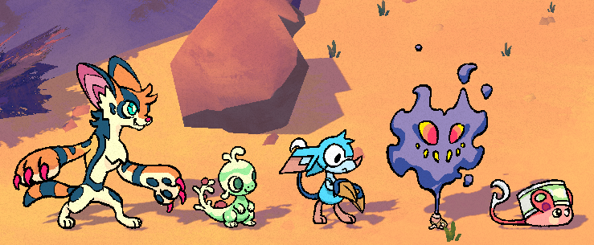
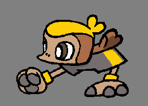

+++
title = "How We Name Beasties"
slug = "how-we-name-beasties"
description = ""
[taxonomies]
tags = ["archived",]
+++

Naming a Beastie is one of those things that’s very complex, despite looking simple. Or… does it look simple? I don’t know. Well, either way, it isn’t!!!

Here are some of the guidelines we tend to run through when determining a Beastie name.
<h3>It has to convey information about the Beastie</h3><figure><figcaption>Servace, Sprecko, Bildit, Gastic, Trat…</figcaption></figure>
Creating Beasties poses such a unique and difficult design challenge. At a glance, players need to understand <em>as much as possible</em> about their personality, theme and playstyle - to create a moment where players see a creature for the first time and have a strong emotional reaction to it, informing whether they want it on their team or not. 

Names are fully part of this! We try to pack as much information as we can in the name to clue players in on who this Beastie is and what their deal is. 
<h3>It has to be fun to say</h3>
Another way we think about it is whether the name sounds like a name people would actually give to something. Think about everyday animal names like Kangaroo, Dog, Tiger, Lizard… they don’t “mean” anything besides the animal they refer to. Of course, there’s always a reason behind a name, but often we preference names that are short and sweet and unique. 

Sometimes it’s tempting to go for an elaborate pun name that’s packed with funny flavor, but if the name doesn’t have a nice and simple mouthfeel, then it usually comes off as contrived. Another way to look at it: getting a laugh out of a player when they first hear a name is great, but then they’ll have to keep reading that name and saying it for many hours after that. Every Beastie name has to survive this kind of long exposure and scrutiny!

If this sounds like it’s in total opposition to the previous rule: <em>yep, it is!!!</em> We have to keep all these conflicting forces in balance.
<h3>It has to be easy to read</h3>
We’ll often refine the spelling of a Beastie’s name many times after we’ve settled on its phonetics. We go for words which LOOK fun and leave minimal ambiguity for pronunciation. Naively combining words tends to create weird-looking pastiches that don’t look great to read. For example, for a long time this Beastie was called “<strong>Kichick.”</strong>
<figure></figure>
Not that it’s <em>terrible,</em> but all the C’s and vertical lines from K, h, and i all kind of smush together when you glance at the word, don’t they? You notice this friction so much more when you’re sight-reading a made-up word you haven’t seen before. 

All that to say, in my opinion, it’s just a <em>little</em> bit easier to read <strong>Kichik</strong>! We’ll often look for these small ways to simplify words and spelling without losing the meaning.
<h3>It has to sound different from other Beasties</h3>
Each name carves out an audio-lingual space that belongs to each Beastie. Just like their visual design, it’s part of what establishes their individuality! So we go to great lengths to give each Beastie’s name their own unique flavor (unless they are actually related). We try to diversify the letters that names start with, the number of syllables, and the suffixes… As much as we can, anyway. 
<h3>The GOLDEN RULE: an ideal name has at least 3 meanings!</h3>
Generally, it’s pretty easy to slap two similar-sounding words together to create a name which suggests the combination of idea A and B. For any given Beastie, there might be tons of possible combinations like these which work about as well as one another. But what we strive for (and don’t always reach!) is for the name to evoke an extra third meaning on top of that - when a name reaches this bar, it almost always stays on as the final one.

As an example, consider one of my favorites - Servace!
<figure></figure>
Their name combines “Serval” (their animal inspiration) and “Ace” (the point-scorer on a volleyball team). But their combination also hints at “Service Ace,” a volleyball serve which wins in one shot. Even though Servace is a net player and not necessarily great at serves, the extra meaning is “close enough” to make this name really land, in my opinion.
<h1>A Case Study…</h1>
One Beastie debuted for the first time in our previous playtest with a name we weren’t 100% set on. We’re happy to re-introduce them with an updated name!
<figure><figcaption>Kaleidarn: Their bodies are made from hard translucent chitin. Depending on the arrangement of their cells, they refract light differently and can appear as vastly different colors.</figcaption></figure>
Kaleidarn is a dragonfly-inspired Beastie that appears as if they’re made of glass. They’d been notoriously tricky for us to name for a variety of reasons. For one thing, “dragonfly” is a very cool-sounding name, and it was tempting to make a new name out of it, but it never felt quite right. Calling them a “dragon” distracted from the fact that they’re actually a bug, and “fly” is a fairly generic suffix (which we also already had used for insect Beasties like Cherrily and Merrifly (Merrifly hasn’t shown up outside playtests yet… sorry, all in due time!)). “Glass” is also a tricky word to work with - it doesn’t pair well with other words and when it’s taken out of context it can very easily sound like a cuss.

In the Preview Playtest this Beastie was called “Dragla,” a very straightforward word pairing that was lacking in any special spark. We tried and discarded many names before and after that, including Shatterfly (that generic “fly” suffix, and also this makes them sound fragile…) and Dralucent (which feels “almost there,” but still is a relatively flavorless word pairing without strong extra meanings). 

“Kaleidarn” hits our key criteria, combining “darner,” and “kaleidoscope,” itself a word evoking glass as a beautiful refracting multi-color effect which suits this Beastie’s rainbow theming. It also sounds like “collide,” a suitable word for a bug who regularly rams a sports ball. Kaleidarn’s unique trait, “Nimble,” gives their team an extra action when this Beastie receives the ball, so they do indeed reward players who let them collide. 

This is a game that’s still in development, and we’re always updating our ideas, designs and names in the background before we reveal them to the world. There’s no guarantee that we won’t think of an even better name for Kaleidarn before the game finally comes out. But perhaps this gives you an insight into our process, what makes it so hard, and how it’s always evolving!

