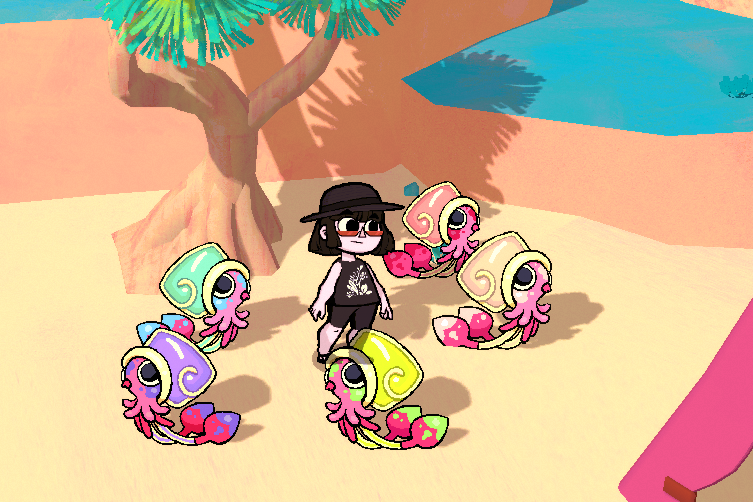
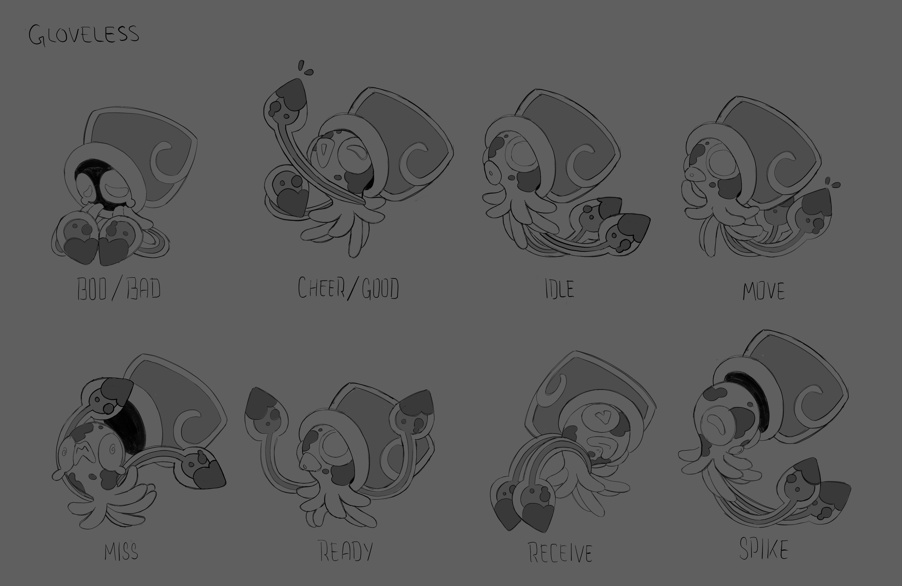
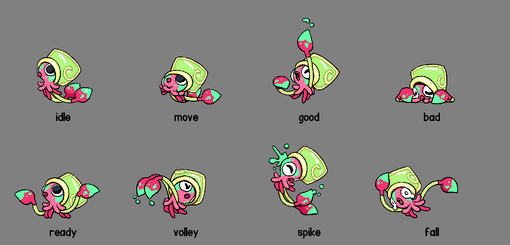
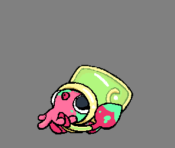

+++
title = "Squimage, the rainbow painter squid!"
slug = "squimage-the-rainbow-painter-squid"
description = "A cute and colorful challenger you may find on the beach..."
[taxonomies]
tags = ["archived","beastieball"]
+++

Ah, the Chroma Sea… a vast ocean zone, dotted with islands and enclosed by a massive barrier reef. You’ll need to take out a rental sailboat if you want to navigate those waters. And for coaches who explore its sun-kissed shores, you might rarely find this colorful challenger hankering for a Beach-stieball match.
<figure><figcaption>Squimage: Each one has a unique ink color. They tend to form colonies of similar color and mark their territory with vivid graffiti.</figcaption></figure>
Squimage is unique among Beasties in many ways. For one, they have an exceptionally wide range of color variations - an individual Squimage’s ink can be just about any color of the rainbow.
<figure><figcaption>Just some of the many colors you may find a Squimage in. Go find one in your favorite color!</figcaption></figure>
Squimage are eager learners, adept at mimicry and able to learn a surprisingly wide range of skills. They’re one of the very, very select group of Beasties who can wield <strong>Body</strong>, <strong>Spirit</strong> <em>and</em> <strong>Mind</strong>-type plays, making them a diverse threat that’s challenging to defend against. It’s not just a gimmick! Their POW stats in all types are quite high, so if you underestimate them then you’ll surely be punished. 

This multi-type offensive style is supported by their unique trait, <strong>Protean, </strong>which changes any POW boost so that it boosts <strong>all 3. </strong>For example, if a teammate were to boost their Body POW, their Mind and Spirit POW will go up as well. This makes Squimage very effective at providing additional coverage to a team that mostly focuses on only one type of attack and boost.
<figure><figcaption>The final concept pass by Karen…</figcaption></figure><figure><figcaption>…And the final in-game poses drawn by Mike Horowitz (along with the animation)! Notice all the small tweaks?</figcaption></figure>
Squimage was the first Beastie designed by <strong>Karen Centella Sánchez </strong>and came from one of the very first basic creature prompts we ever considered. We were excited to use this design to showcase the strengths of our color variation system - while also paying homage to our history with <a href="https://store.steampowered.com/app/1123450/Chicory_A_Colorful_Tale/">painting animals.</a> Squimage is a Beastie’s that’s very close to our hearts.
<figure></figure>
Our next newsletter will have some big updates on our plans for 2024. We’ll see you there!

