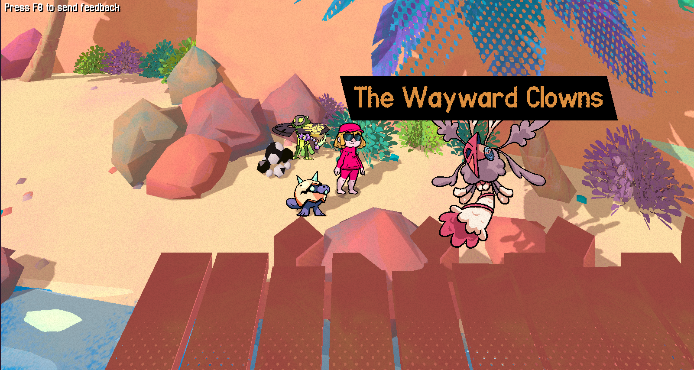
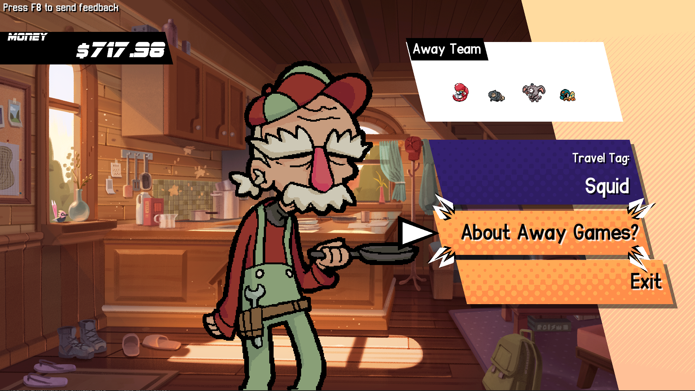
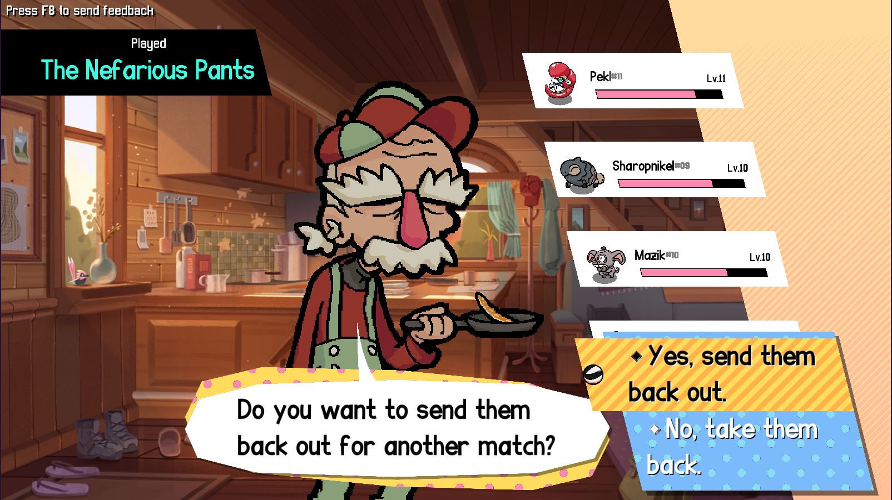
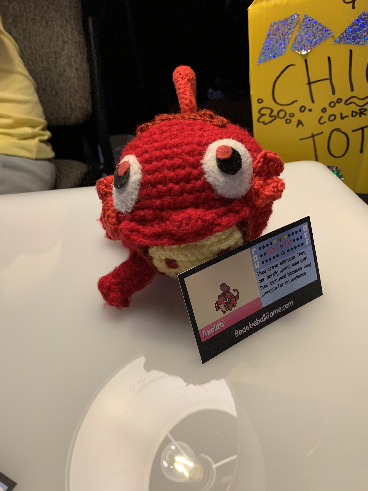

+++
title = "Invading Other Players' Adventures!"
slug = "invading-other-players-adventures"
description = ""
[taxonomies]
tags = ["archived",]
+++

Sometimes while you’re out and about re-exploring previous areas, you’ll find new roaming Beastie teams hungry for a match!
<figure><figcaption>The Wayward Clowns have appeared!</figcaption></figure>
These encounters aren’t pre-designed by us. They’re visitors from another player’s world: an <strong>Away Team!</strong>

If your team has expanded to include a few reserves, you’ll be invited to create an Away Team from any Railhouse (fast travel location). You can pick any of your reserve Beasties and send them away to challenge other players.
<figure></figure>
The <strong>Travel Tag</strong> is a secret phrase you can enter; you can put anything in that field! Players who share a Travel Tag will be much more likely to encounter each other’s Away Teams, so you can use it to invade your friend’s adventures with your own Beasties, or perhaps a favorite streamer.
<figure></figure>
After they’ve appeared for another player, they’ll return to your world. You’ll find out the team name of the player they faced, and they’ll also pick up some extra EXP for their effort!
<figure></figure>
I’m really excited about away teams; I think they’re one of the coolest features we were able to add to this game. They’re a super-popular feature among players that have joined our past <a href="https://greglobanov.substack.com/p/playtest-results-beastie-popularity">Playtests</a>. In fact, I wouldn’t be surprised if other creature collecting-style games start using the idea at some point in the future (I haven’t seen it before). It gives your extra Beasties something to do, and a way to show off your Beasties to other players without having to actively coordinate or play competitively.

In general, I’m really interested in <strong>asynchronous multiplayer</strong> features and I’m still brainstorming adjacent concepts we could implement. Beastieball is primarily a single-player adventure, with limited multiplayer components. As a small-sized indie studio, we can’t expect the game will ever grow to have a massive and active community which supports large-scale multiplayer. <em>Maybe</em> it will! But many larger companies have tried and failed to sustain an active online community for their games in the past, so it would be unrealistic to plan around that ourselves. Asynchronous features are wonderful because they give players a chance to interact and see each other even when they’re not playing at the same time, making even a tiny community feel active and well-connected.

Speaking of…
<h2>PAX Champ Challenge Results!</h2><figure><figcaption>Behind the scenes setting up our booth</figcaption></figure>
Last month the team went off to PAX West in Seattle. We had a great time showing off the game to players old and new!
<figure><figcaption>We had many very heartwarming interactions with fans, but just one we’d love to call out was this crocheted Axolati somebody surprised us with!</figcaption></figure>
For this show demo, we added a temporary special feature called the <strong>Champ Challenge. </strong>Every demo station had a current champion named on the title screen. Instead of playing the usual demo, players could opt into challenging the current Champ; if they did so, they were assigned a random team of 4 Beasties and took on the previous Champ’s team in a bossfight-like encounter. And if they won, their team would take over the demo and their name would be added as the current Champ!
<figure></figure>
I’m happy to announce the final results from this silly challenge we put out. Here are the top 3 champs, ranked by their number of wins against opponents!

In third place: <strong>Channel</strong>, with 5 wins!

In second place: <strong>Skyphire</strong>, with 6 wins!

And number one was the unstoppable <strong>Games</strong>, with <em>22 wins!</em>

The mysterious champion known simply as Games worked hard to defend their title. They held the champ title on every demo station for most of the day they attended PAX. Well done, Games! You truly earned this victory.
<h2>Thanks!</h2>
In the background we’ve been incredibly busy working on the game and getting ready for our final Playtest and Early Access release this year. We’re excited to share more updates on those before too long!

