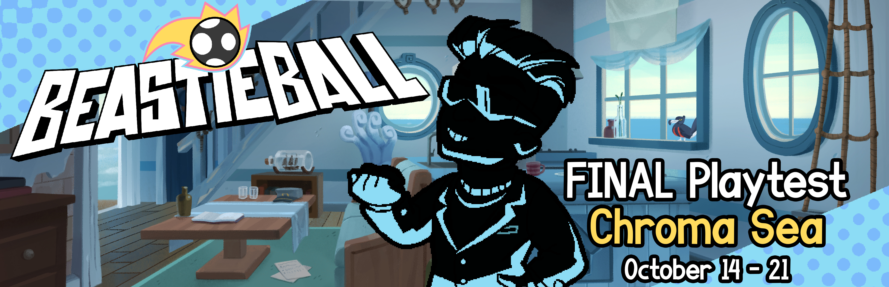

+++
title = "The FINAL PLAYTEST is next week!"
slug = "the-final-playtest-is-next-week"
description = "Visit the Chroma Sea from October 14 to 21!"
[taxonomies]
tags = ["archived","beastieball"]
+++
<figure></figure>
It’s time for the Final Playtest, from <strong>October 14 to 21! </strong>This Playtest will include all previous Playtest content along with a brand-new taste of the <strong>Chroma Sea</strong>, a vast ocean area with tons of new Beasties to discover!

If you want to play, <a href="https://store.steampowered.com/app/1864950/Beastieball/">visit the game on Steam</a> and click ‘<strong>Request Access</strong>’! (And be sure to wishlist us while you’re there too 😇)! <strong>If you’ve had access to any previous Playtests then you’re already included!</strong> Otherwise, we’ll start sending keys out in batches starting on October 14. Note that requests are granted by random selection and not everybody will get in.
<ul><li>
(If you’re a Content Creator, you can request a playtest key via <a href="https://www.keymailer.co/g/games/94e5e9d0">Keymailer here.</a>)
</li></ul><h2>Playtest Showdown</h2>
With this being the final Playtest before our Early Access release, we’re going out with a bang. On Sunday October 20 - right as the Playtest is ending - we’re going to host the first ever Invitational Beastieball Tournament<strong> </strong>for our most competitive community members. Whoever wins will be crowned the first-ever Beastieball champion!

For anybody who wants to be part of the community around the Playtest, or follow the invitational tournament, we highly recommend you <a href="https://discord.gg/VUcsuU8SRC">join our Discord community!</a>

Lots for us to work on now… see you next week!
