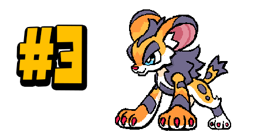
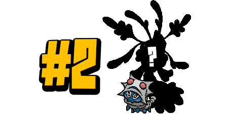
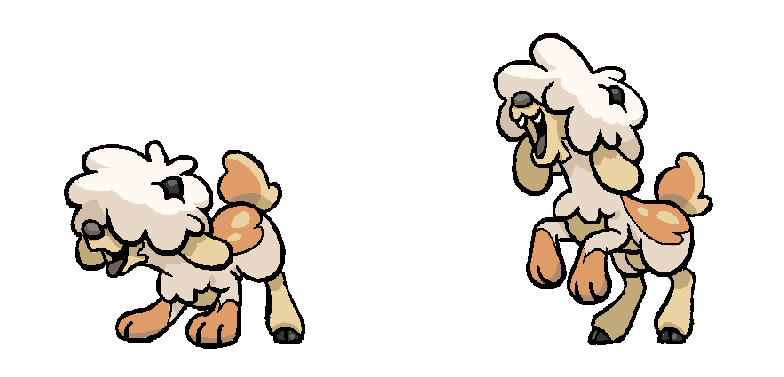

+++
title = "Playtest 3 results: the most-used Beasties!"
slug = "playtest-3-results-the-most-used"
description = ""
[taxonomies]
tags = ["archived","beastieball"]
+++

Playtest 3 ended on Monday! I want to thank everybody who took the time to play and send in feedback. We had more players than ever, with an overwhelmingly positive response and fewer bugs/issues reported, which is reassuring to say the least. 

In case you missed it, at the end of the Playtest we hosted the first-ever invitational Beastieball tournament for some of the most competitive members of our Discord channel. The games were quite high-level, despite using only a fraction of the Beasties that are coming in the full release. As a commentator, I had a huge amount of fun! For now, you can check out the recording here: <a href="https://www.twitch.tv/videos/2280972379">https://www.twitch.tv/videos/2280972379</a>. We’ll be uploading it to Youtube soon so that it’s preserved. Just be warned that it includes a ton of spoiler Beasties!

For this Playtest, we ran some analytics to figure out which Beasties players were using the most. Not the <em>most recruited</em>, which is more sensitive to in-game spawn rates, but the actual most <em>used:</em> what Beasties are players keeping with them and bringing into important matches? To get a sense of this data, we looked at what Beasties players brought to the final boss they could play in this Playtest. Here are the results, excluding the Beasties everyone starts with!
<figure><figcaption>#10: Cherrily! (~11.5% of players)</figcaption></figure><figure><figcaption>#9: M??????? (~11.5% of players)</figcaption></figure><figure><figcaption>#8: Rookee! (~12.5% of players)</figcaption></figure><figure><figcaption>#7: Shooga or S??????? (~17% of players)</figcaption></figure><figure><figcaption>#6: Kaleidarn (~17.5% of players)</figcaption></figure><figure><figcaption>#5: Skibble or S?????? (~18% of players)</figcaption></figure><figure><figcaption>#4: W?????? or F?????? (~31% of players)</figcaption></figure><figure><figcaption>#3: Servitt! (~32% of players)</figcaption></figure><figure><figcaption>#2: Collarva, W?????? or P?????? (~34% of players)</figcaption></figure><figure><figcaption>#1! Sefren or Z????? (~36% of players)</figcaption></figure>
It’s fair to say this ranking is still very biased by the Playtest format; Beasties from earlier Playtests definitely had a leg up on the new ones statistically, since players continuing their saves will tend to stick with the ones they have. It’ll be interesting to see how different the rankings are for the full game, when players have every area available from the outset!

But hang on a second, who were all those mystery Beasties??? Well, there’s definitely too many to show them all off now, but in honor of their popularity, I think it’s time we pull back the curtain just a little bit on our pesky friend at #4.
<figure></figure>
Wagdash, the sheep-dog Beastie! This playful pup is more ball-obsessed than most Beasties, and that’s saying a lot. They’ll chase the ball restlessly and never get tired!
<figure></figure>
In terms of playstyle, this Beastie loves when the ball comes to them and plays a more defensive role on the field. They’re not just a tank, though; their trait, <strong>Fetch</strong>, makes them <strong>feel Jazzed</strong> whenever an attack hits them, and that gives their follow-up attack 1.5x boosted damage. As their opponent, you may want to keep the ball away from them!
<figure></figure>
But that’s not all! Wagdash has <strong>a variant morph</strong> which can appear occasionally, with white fur. It’s not the same as a <strong>raremorph</strong>, which are ultra-rare; variant morphs are much more common alternative appearances you may find a Beastie in. Generally, variant morphs are statistically identical to the standard morph, and relatively easy to find, so you should mostly just try to recruit the one you like the look of the best!

Anyways, it’s time for us to put our heads down and get back to work on the game! This Playtest was <strong>the final one</strong>; the next time we release something, it’s going to be <strong>the entire adventure. </strong>Please stay tuned for news on that soon!

