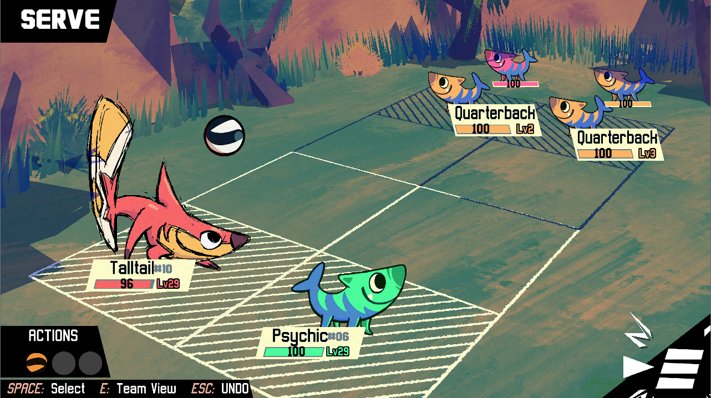
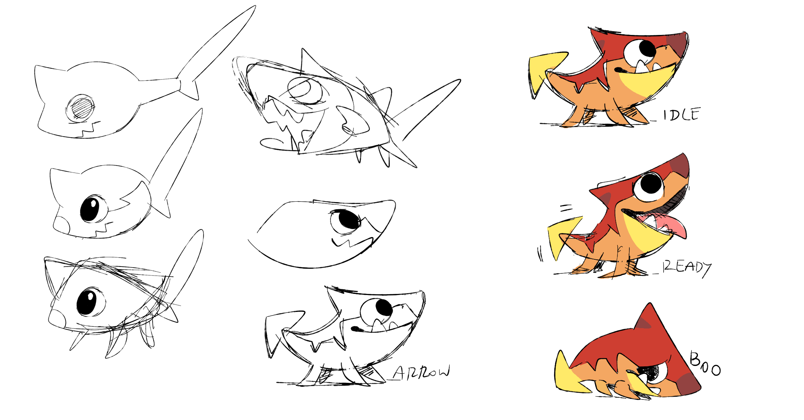
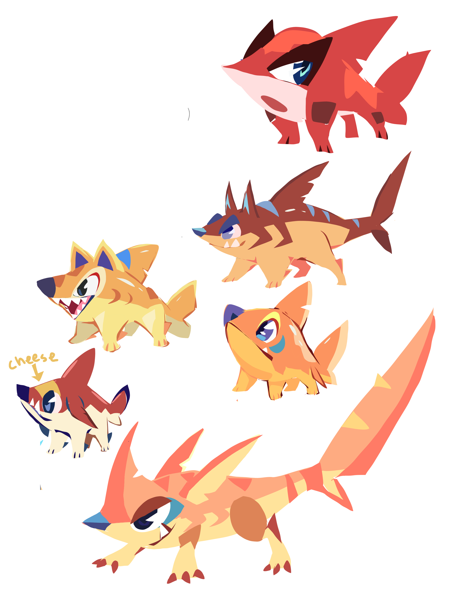
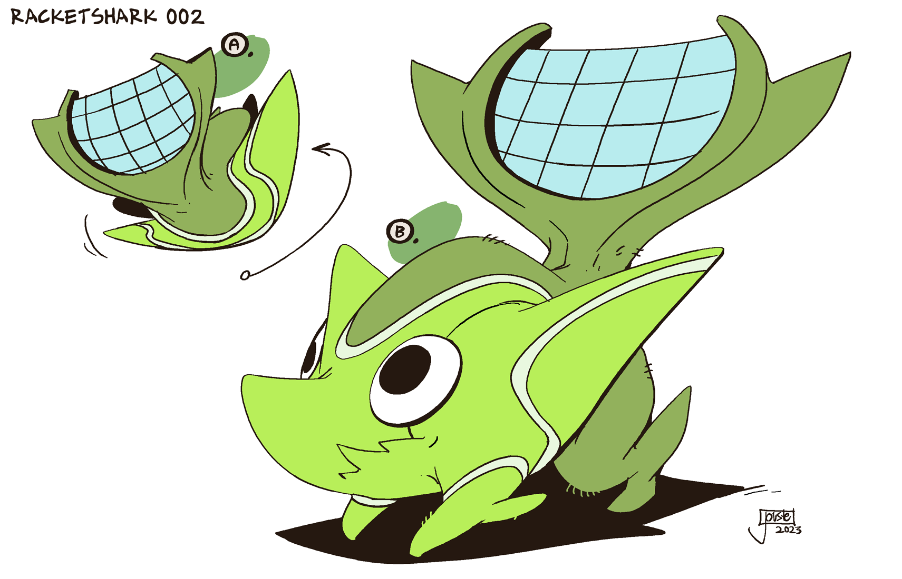

+++
title = "Sometimes You Go With Your Gut (designing Waglash and Riplash)"
slug = "sometimes-its-just-a-guy-designing"
description = ""
[taxonomies]
tags = ["archived","beastieball"]
+++

Beastieball came out a month ago!!! :D Thank for the incredible reception.

We can finally divulge more behind-the-scenes info on our process designing many Beasties who are no longer being kept secret. Every Beastie had a unique process, and each has many stories to tell… but it’s only fitting to start this series with the first Beastie we ever designed. That same Beastie is paired with the last one we ever finished, only hours before the game released. I’m talking about Waglash and Riplash.

I started prototyping Beastieball in summer 2020, while we were still primarily focused on Chicory. By the time Chicory released in June 2021, I had pretty well-defined systems and a solid game foundation for Alexis to start designing creatures for. She excitedly got to work, messing with shapes and animals and feeling out what we even wanted our creature design style to be. She started out drawing sharks, trying to find an appealing personality and a body that could work on land, and we ended up with a pair of Beasties that looked like this:
<figure><figcaption>For years after this, the little shark-dog was used a placeholder for any Beastie that had no set design, so every little shark-dog you see here is actually something else…</figcaption></figure>
The large shark was based on thresher sharks, which use their tail to create underwater shockwaves (incredibly cool). Alexis imagined the tail as a massive implement that could thwack the ball super hard, and then drew up a cute little baby version to go with it. I found some process drawings for the little shark, who we called Shuppy:
<figure><figcaption>(the animation on the right uses colors that get swapped by a shader in-game)</figcaption></figure>
These designs were a great way to test out our whole system for coloring, posing and animating! But as our roster of Beasties grew, they started to feel pretty thin. <a href="https://greglobanov.substack.com/p/behind-the-scenes-designing-bildit">Most Beasties are designed with rich underlying themes and personalities</a>, but these sharks were basically just… sharks that looked cute/cool. Worse, we started noticing shark-dog designs were not an especially original idea; there was even a <a href="https://en.wikipedia.org/wiki/Sharkdog">Netflix show</a> that debuted while we were working. So we felt we needed to dig a lot deeper and find a new direction for our sharks.
<figure></figure>
We asked Karolina 'Twarda' Twardosz (designer of Bildit, Gastic, and many more…) to take a shot at a few explorations, trying to find whole new angles to take for the shark designs. It was around here that we really started to feel the weight of the problem. Sharks are an iconic animal; they’ve been cartooned in many ways by many artists. It’s really, really, really hard to make a shark that feels familiar enough to feel like a shark, but is original enough to not look like a shark you’ve seen somewhere else. The tail was the strongest anchor we had (which you can see Twarda playing with in these ideas), but it wasn’t a strong theme to build on, resulting in a lot of drawings that didn’t have a strong impact and no clear path to being finished.
<figure><figcaption>Left: drawings by Twarda. Right Drawings by Tia Rohrer.</figcaption></figure>
When we asked artists to take a crack at redesigning the shark, the first response was almost always “Why? I like this one.” We got a few iterations of artists trying to take the ideas we had already and spruce them up a bit. But the lack of a strong theme felt like it was holding the design back. This was when I proposed a radical new idea: What if the sharks were tennis-themed?! Maybe the big shark’s tail is a racket, and the baby shark is a tennis ball. We could call them Thracket and Pubber! We got artists to pitch us some ideas based on that pitch:
<figure><figcaption>Far left: drawings by Tia Rhorer. Center, right: drawings by Jesse 'Jouste' Turner.</figcaption></figure>
Like before, we had drawings that were good but nothing that felt like “the one.” The big sharks especially felt like they were hitting the prompt, but had lost everything appealing about the original big shark design. We were really stuck on this one and wound up putting it into hibernation for a while, keeping the original prototype sketches as placeholders in the game.

Months and years were passing while we iterated on and processed these ideas. Friends, family, and journalists were playing early builds of the game, encountering our prototype shark, and often recruiting it onto their team - it was one of the more popular designs among pre-release playtesters! This only increased the pressure on us to figure out how to finalize the design in a satisfying way.

Before we knew it, Playtests were coming out, and we’d soon be debuting the Chroma Sea area to players with no final shark design. At the eleventh hour, while sick with Covid, Alexis locked herself in a room and drew shark babies searching for some idea that was going to work. That’s when we got these drawings:
<figure></figure>
This cute design was inspired by land-walking <a href="https://en.wikipedia.org/wiki/Epaulette_shark">Epaulette sharks</a>, with patterning that rode the line between “Epaulette shark” and “dog.” To solidify the theme a bit more, I suggested shifting the colors to look more like a Beastieball (spotted black and white), with the idea being that they’d be a ball-mimic Beastie. This felt like a solid foundation to build on, but this conversation was happening only hours before Playtest 3 released. We got the updated art in with only minutes to spare, before anyone else on the team even knew we’d done it. It felt like we’d dodged a bullet!
<figure><figcaption>The day of the playtest…</figcaption></figure>
<a href="https://www.beastiepedia.net/wiki/Pubber">Pubber</a> made a big splash in Playtest 3. The only problem was that we had a baby shark we liked, and no matching adult design that went with it, and the game was coming out in less than a month. NO BIG DEAL!!!!!!
<figure></figure>
On top of everything else she needed to get done in time for release, Alexis was iterating on ideas to merge the spotted-ball theme of Pubber with our existing adult shark design. The key issues were; Pubber's design has a more solid/three dimensional feeling compared to the original sharks, Pubber's colours are completely different, and (maybe most importantly) there was absolutely no common theming or personality between the two. Pubber is a long, cute, floppy critter who curls into a ball, and the bigshark is a toothy guy who hits things really hard with their giant tail. We came up with some designs that kind of approached solving the first two - but the 3rd issue was still totally unaddressed. On top of that, we were struggling to find a design whose appeal surpassed the original bigshark sketch we already had waiting in the game. Everything that brought them closer to Pubber also took them further away from what worked in that design.
<figure></figure>
On November 11, with less than 24 hours before the game came out, Alexis made the tough decision to start over on the baby shark again. We realized that there was just no graceful way to redesign the big shark to match Pubber without a total reboot, including its ingame stats/traits. There wasn’t time left for that; and we all still liked the original big shark!

There’s definitely a lesson to be learned here. All through development we'd been talking about redesigning the sharks, and nearly always that was met with 'aww, why?'. After years crafting designs rich with meaning and theming, it was difficult to just go with our gut and use the simple first idea we’d started on. But in a sea of high-effort Beastie designs, Riplash still stands out as a cool and simple character.

If we took that design as near-final, then we needed to come up with a baby design that matched it better - so Alexis went back to the drawing board, looked at all the iterations we’d done and decided to keep it extremely simple. She tried to give the design a bit more of a thought-out shape and appeal, and put in some thresher-tail flavour to lead into the adult design. Their big boggly eyes are also inspired by threshers.

Back when we were hunting for our perfect shark design, our imaginations were captured by this video on (among other things) <a href="https://www.youtube.com/watch?v=zQukzrJs0s4&amp;t=1014s">Great White Shark social behaviour</a>. Did you know that great whites settled disputes with splashing contests? Contrary to popular understanding, great white sharks are actually risk-averse, sensitive creatures who avoid violence. The fact that they play a game to assert dominance over one another, rather than attack with all the murderous tools available to them, really resonated with the world of Beastieball. So we made sure to include a subtle nod to this in the design and lore of Waglash, the final Beastie we added just before release.
<figure><figcaption>Welcome to the family, Waglash.</figcaption></figure>
As for Pubber, the spotted shark design who we couldn’t fit in, we’d like to reintroduce them in the future with different stats and a newly designed adult form that better matches their particular theme. We’ve still got plenty more game to make, after all!

I’ve been tremendously busy keeping up with bugs and feedback while also planning out the rest of our game’s development in the public eye of Early Access. I missed getting to write newsletters! There’s so much more to share about this game and I can’t wait to get into it more with future instalments. :)

