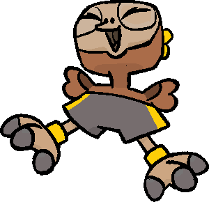
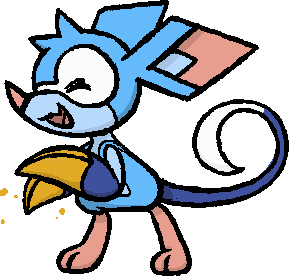

+++
title = "Starter Bigmoon Contest Results!"
slug = "starter-bigmoon-contest-results"
description = ""
[taxonomies]
tags = ["archived","beastieball"]
+++
<figure></figure>
This weekend we held the second <strong>Bigmoon Bash</strong>, an in-game event where players could match up into each other for limited time! This one lasted for 24 hours, and saw 376 players play 4,019 matches (!!!).

For the first time, the bash also had a theme; it was a contest between Kichik, Axolati, and Bildit, and 3 Beasties players can choose as their starter. Every player had to use EXACTLY one Beastie related to one of these 3, with their results contributing to that Beastie’s global score. <strong>Here are the final results!</strong>
<figure></figure>
<strong>Kichik is the Bigmoon Champion</strong>, with a final Bash Score of 2008! 
<h1>Top Players</h1>
Let’s take a moment to honor the coaches who earned the most victories for their favorite starter!
<figure></figure><h3>Team Kichik</h3><ol><li>
<strong>Dino - 102 wins</strong>
</li><li>
CORELAR - 43 wins
</li><li>
Rosery - 42 wins
</li><li>
P3Rcarus - 41 wins
</li><li>
Clifford - 37 wins
<figure></figure><h3>Team Axolati</h3></li></ol><ol><li>
<strong>Patatin - 86 wins</strong>
</li><li>
Fujoball - 56 wins
</li><li>
Pix - 45 wins
</li><li>
Red murderer - 44 wins
</li><li>
Cam - 40 wins
<figure></figure><h3>Team Bildit</h3></li></ol><ol><li>
<strong>René - 87 wins</strong>
</li><li>
Figgy - 56 wins
</li><li>
Ren - 51 wins
</li><li>
Oiuja - 40 wins
</li><li>
Erin - 39 wins
</li></ol><h1>Usage Statistics</h1>
After the previous Bash, we shared <a href="https://greglobanov.substack.com/p/pvp-event-results-favorite-beasties">detailed stats on the most used Beasties</a>. With this event having a team-building restriction, the usage statistics are obviously quite skewed… But, for data-hungry coaches, here are the top 10 most used Beasties by players whose Bash Score was <strong>2400 or higher*</strong>, excluding theme Beasties.
<ol><li>
<a href="https://www.beastiepedia.net/wiki/Noizard">Noizard</a> (35.7%)

Noizard’s <strong>Clamor</strong> trait makes it Noisy anytime it tags in. This allows it to redirect attacks away from its allies safely, helping its teammates stay on the field just a bit longer! It fits on just about any team, so it makes sense for Noizard to see high usage. It was popular in the last Bash, but it seems many more players have discovered its utility since then.
</li><li>
<a href="https://www.beastiepedia.net/wiki/Cherrily">Cherrily</a> (18.8%)

Cherrily’s <strong>Cheerleader</strong> trait adds 10 damage to any attacks its ally does. Combined with an impressive array of support, Cherrily is an incredible offensive enabler that can give any team an extra edge.
</li><li>
<a href="https://www.beastiepedia.net/wiki/Kaleidarn">Kaleidarn</a> (17.5%)

Kaleidarn may be made of glass, but when you hit it, its <strong>Nimble</strong> trait activates and gives its team 1 extra action. Actions are incredibly valuable, particularly on teams that want to string together devastating combos and 1-turn wipeouts. 
</li><li>
<a href="https://www.beastiepedia.net/wiki/Crabaret">Crabaret</a> (17.0%)

I finally get to talk about Crabaret! This tap-dancing crab is one of the, if not <em>the,</em> most threatening body attacker in the game capable of dishing out big hits. It’s also dangerous to hit into with its ability to <a href="https://www.beastiepedia.net/wiki/Juggle">Juggle</a>, boosting its power while keeping control of the ball.
</li><li>
<a href="https://www.beastiepedia.net/wiki/Bongus">Bongus</a> (15.2%)

Bongus recently saw a major change with its new <strong>Welcoming</strong> trait added, restoring 40 stamina to its allies when it tags them in. It’s also one of the premier users of Rhythm, able to set up the musical field effects which helps it pair well with other popular picks like Crabaret and Hopra.
</li><li>
<a href="https://www.beastiepedia.net/wiki/Heliath">Heliath</a> (14.7%)
</li><li>
<a href="https://www.beastiepedia.net/wiki/Beetlback">Beetlback</a> (13.9%)
</li><li>
<a href="https://www.beastiepedia.net/wiki/Illugus">Illugus</a> (13.7%)
</li><li>
<a href="https://www.beastiepedia.net/wiki/Demolipede">Demolipede</a> (13.0%)
</li><li>
<a href="https://www.beastiepedia.net/wiki/Gremlur">Gremlur</a> (12.9%)
</li></ol>
<em>*This data samples teams that were used in a match by a player whose Bash Score was at least 2400 at the time when the match started.</em>

I have to say I was surprised to see quite a few different Beasties appear in the rankings this time! This game’s meta is still developing very rapidly, with Beasties seemingly falling in and out of favor quite often. It’s exciting to see players experimenting and finding creative uses for all their favorite creatures.
<h1>Thanks for Playing!</h1>
As with the last event, we’ll be looking closely at usage statistics and other results to help us adjust the game balance. On a personal note, it also was a great honor to get to play in this event with so many enthusiastic opponents. I’m already looking forward to the next Bash…

Happy Bigmoon!
