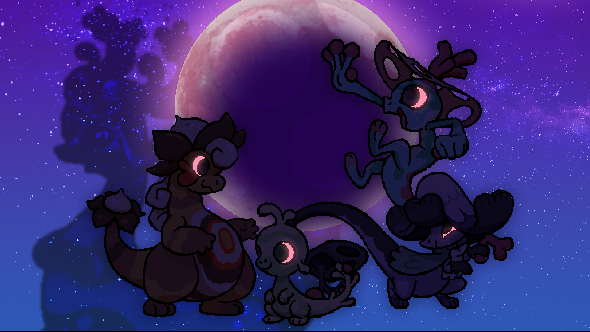
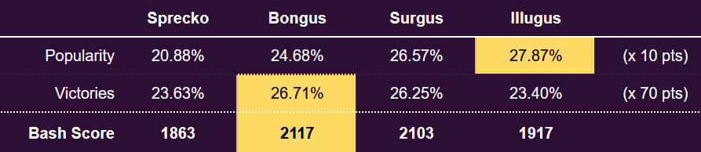

+++
title = "Spreckomorph PvP Bash Results!"
slug = "spreckomorph-pvp-bash-results"
description = ""
[taxonomies]
tags = ["archived","beastieball"]
+++
<figure><figcaption>Sprecko, Bongus, Surgus and Illugus clashed in this weekend’s BIGMOON BASH!</figcaption></figure>
This weekend we held another BIGMOON BASH, an in-game event where players could challenge each other for 24 hours. This Bigmoon was a themed one, challenging players to use a form of Sprecko, thereby contributing towards their favorite’s global score. Here are the final results after a nail-bitingly close contest!
<figure></figure>

<strong>This Bash’s Champion is BONGUS!</strong>

<em>*Note on Bash Scoring: Scoring is adjusted each Bash depending on the number of guilds so that the average Bash Score is always 2000. This did not impact the results of this Bash.</em>
<h1>Top Players</h1>
Let’s take a moment to honor the coaches who earned the most victories for their favorite guild!
<figure></figure><h2>Sprecko Guild</h2><ol><li>
Dino (61 wins)
</li><li>
Pryn (49 wins)
</li><li>
Renee (39 wins) (tie!)
</li><li>
Robin (39 wins) (tie!)
</li><li>
Nalathni (31 wins)
</li></ol><figure></figure><h2>Bongus Guild</h2><ol><li>
Patatin (93 wins)
</li><li>
Pyopyo (65 wins)
</li><li>
Pix (54 wins)
</li><li>
Cam (51 wins)
</li><li>
Mal (37 wins)
</li></ol>

<figure></figure><h2>Surgus Guild</h2><ol><li>
Figgy (90 wins)
</li><li>
René (78 wins)
</li><li>
Ket (76 wins)
</li><li>
Mintonette (46 wins)
</li><li>
Luiz (45 wins)
</li></ol><figure></figure><h2>Illugus Guild</h2><ol><li>
Wad (73 wins)
</li><li>
Astra (59 wins)
</li><li>
Knight (50 wins)
</li><li>
Rosery (49 wins)
</li><li>
Dorothée (46 wins)
</li></ol><h1>Usage Statistics!</h1>
These Beasties were the top most used by players in this Bash! <em>(Excluding theme Beasties). </em>There are plenty of familiar faces, but some surprising new ones as well!
<ol><li>
<a href="https://www.beastiepedia.net/wiki/Noizard">Noizard</a> (24.1% of teams)
</li><li>
<a href="https://www.beastiepedia.net/wiki/Bandicraft">Bandicraft</a> (19.3% of teams)
</li><li>
<a href="https://www.beastiepedia.net/wiki/Hopra">Hopra</a> (17.2% of teams)
</li><li>
<a href="https://www.beastiepedia.net/wiki/Deluja">Deluja</a> (15.1% of teams) Many players opted to bring Deluja to this Bash, likely anticipating that with the theme, there’d be a lot of field effects to contend with! Deluja’s <strong>In the Clouds</strong> trait gives them immunity to field effects, allowing you to maintain your strategy no matter what weird stuff the opponent is up to.
</li><li>
<a href="https://www.beastiepedia.net/wiki/Heliath">Heliath</a> (15.1% of teams) Heliath is an extremely solid choice for Rally teams, as one of the few Beasties able to set up Rally and also take advanage of it with high-damage offense! They’re often paired with Surgus, so it makes sense to see them pop off in this bash.
</li><li>
<a href="https://www.beastiepedia.net/wiki/Lunaptra">Lunaptra</a> (13.6% of teams) Lunaptra was the #1 most-paired Beastie with Illugus (they appeared on teams together 31.3% of the time!) I’m honestly not sure why that is, but it could have to do with disruption strategies combining Illugus’ ability to set Traps with Lunaptra’s propensity for <strong>Dreadful Mist</strong>, a deteriorating field effect that chips away at Beasties while preventing any good feelings.
</li><li>
<a href="https://www.beastiepedia.net/wiki/Tortanchor">Tortanchor</a> (13.4% of teams) Tortanchor’s solid defenses, offensive support via the Captain trait and defensive support with setting Rhythm made them a consistent, steady pick on many different teams in this Bash!
</li><li>
<a href="https://www.beastiepedia.net/wiki/Kaleidarn">Kaleidarn</a> (13.3% of teams)
</li><li>
<a href="https://www.beastiepedia.net/wiki/Crabaret">Crabaret</a> (13.2% of teams)
</li><li>
<a href="https://www.beastiepedia.net/wiki/Boldlur">Boldlur</a> (11.7% of teams)
</li></ol>
Those are the popular ones… but who’s been going neglected? We’ve collected data across both of the most recent Bashes and proudly present to you the <strong>top 5 least-used Beasties</strong> across the last 2 events. <em>(*This is a good time to note that we collect this data using in-game analytics, which players have the option to disable. For Beasties with very low usage, their stats can be very sensitive to the fact that they may have a handful of fans who simply don’t have analytics enabled.)</em>
<ol start="5"><li>
<a href="https://www.beastiepedia.net/wiki/Riplash">Riplash</a> (2% of teams) Riplash hits like a TRUCK, especially with its <strong>Launcher</strong> trait that boosts the power of attacks in exchange for having them always target straight ahead. Players may be finding them difficult to utilize right now, although with a bit of support the reward can be great.
</li></ol><ol start="4"><li>
<a href="https://www.beastiepedia.net/wiki/Diabloceras">Diabloceras</a> (1.8% of teams) Diabloceras has the <strong>Overwrite</strong> trait, deleting the trait of other Beasties when they attack and slowly spreading their corruption across both teams. Beasties who lose their trait will often struggle to make use of their equipped plays, making this Beastie’s disruption particularly nefarious. It’s a double-edged blade that often forces its allies to lose their traits as well, but like Riplash, it can be very rewarding if you build around it.
</li></ol><ol start="3"><li>
<a href="https://www.beastiepedia.net/wiki/Crawlurk">Crawlurk</a> (1.7% of teams) Crawlurk has many ways to hit hard, with its twin <strong>Ambush</strong> and <strong>Hunter</strong> traits boosting its damage on serve or when hitting an opponent that’s just tagged in, respectively. When it’s put into an advantageous position, Crawlurk is one of the scariest attackers you can face. They can consistently wipe out many Beasties just with their serve attack, including popular picks like Surgus. But getting it into that position isn’t always easy.
</li></ol><ol start="2"><li>
<a href="https://www.beastiepedia.net/wiki/Blitzwift">Blitzwift</a> (1.6% of teams) Hey, not again! After we pointed out <a href="https://greglobanov.substack.com/p/pvp-event-results-favorite-beasties">how overlooked Blitzwift was in the first Bash</a>, they saw a renaissance of players enabling ridiculous new strategies and tech with this Beastie. Through some experimental balance patch phases, they rose to prominence among PvP Sickos. Ah, but how fickle gamers can be… Perhaps their era is already over. In terms of success rates, they are still a strong Beastie that rewards any coach that’s willing to step into its wacky world of infinite movement actions.
</li></ol><ol><li>
<a href="https://www.beastiepedia.net/wiki/Magpike">Magpike</a> (0.7% of teams) What is it with coaches overlooking birds capable of incredibly deadly offense? Magpikes may be a sweethearts to their friends, but to opponents, this goth bird is as dangerous as they come, wielding some of the quickest-scaling offensive pessure in the game thanks to their <strong>Trusting</strong> trait giving them extra BOOSTs from allies. I know I’ve said it before, but everybody is wrong about this one.
</li></ol><h1>Thank you!</h1>
I was chuffed to see so many players come back to play in this Bash. Overall, I was really impressed and delighted with the diversity of team building and strategies. It still feels like there’s a lot of room to explore in this game’s meta.

We’re already underway on the next balance patch, which will take into account the results and data from this Bash as well as player feedback. After that patch is ready, we’ll put it to the test with an open-format Bash that invites all Beasties to participate!

