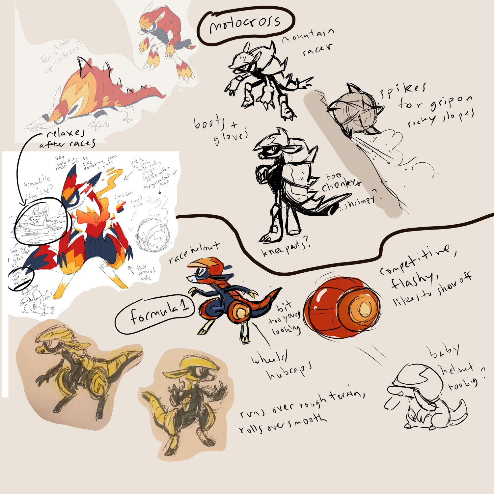
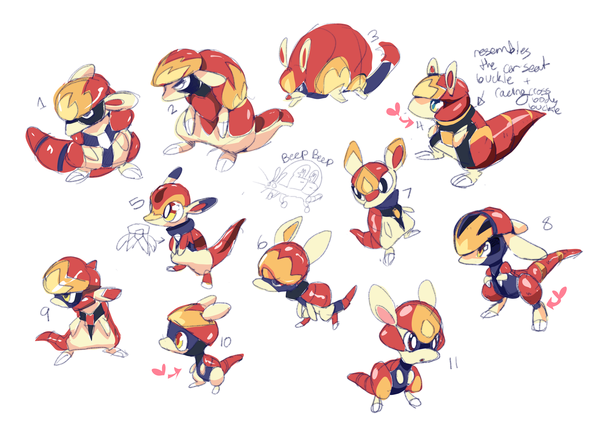
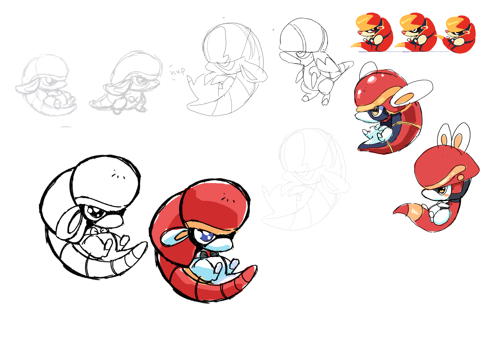
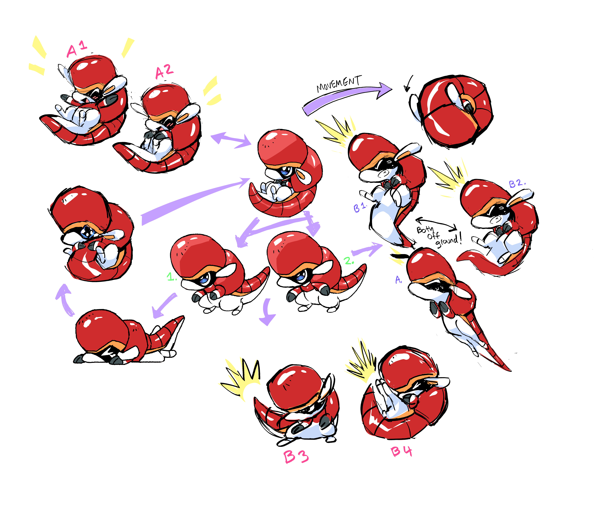
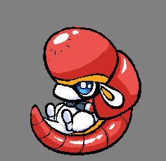

+++
title = "Challenging the Rule of Cool (designing Daredillo and Radillo)"
slug = "challenging-the-rule-of-cool-designing"
description = ""
[taxonomies]
tags = ["archived","beastieball"]
+++

Before we brought external concept artists onto the team, I’d spent a fair bit of time developing different Beasties purely in code and design - using just stats, traits and playbooks to come up with broad sketches of different playstyles, to help inform the range of concept designs we’d need. 

So when Tia Rohrer (AKA Irischroma) joined the team, one of the first prompts we sent them was a <em>‘spirited’</em> Beastie, who focused on spirit power and powering themselves up, including the ability to summon an audience via a play called Rally. Iris always had an explosion of ideas for every prompt, and this “fiery” armadillo was just one of many that they tried for this concept which we decided to pursue further because it was so darn cool.
<figure></figure>
As would become a recurring theme with many designs - often it was easy to come up with something that <em>looked</em> cool, but what was often harder was coming up with a good answer to <em>“why.”</em> Why put a pattern on the shoulders, or not? Why have a big abdomen, or a small one? A skilled artist like Iris could make anything look cool - but when every option looked so cool, we had to start finding some criteria to help filter the options down.
<figure></figure>
One of our core guiding principles on this project was to keep our animal inspirations forward, to make designs that felt naturalistic rather than overly anthropomorphized or fantastical. So following the initial exploration, Iris tried to hone in on a more “armadillo”-like silhouette, to good success! We were starting to see the design shift from something that was generically cool-looking into something that felt more like a Beastie.
<figure></figure>
This was where Alexis stepped in, trying to take what was working with Iris’ design and focus it into a theme. We decided to re-assign the concept; rather than targeting the <em>‘spirited’</em> one, we went to <em>‘daredevil,’</em> a spirit/body-attacking Beastie who got a power up every time they moved on the field, encouraging their coach to make the Beastie shift positions often. We hadn’t had any idea how to execute on that prompt, but Alexis identified that we could point Iris’ ongoing design towards something inspired by Motocross or F1. That in turn gave us clearer answers on how to focus the small details.
<figure></figure>
That push was enough to set Iris on the path straight to Daredillo, just as they appear in the final game! Something really fascinating to observe here is how the design actually got a lot <em>less</em> cool from where it had started. The new rounded shapes add a slight dorkiness… but that only increases its overall appeal. It’s a great example of something we pursued from the start; Beasties can’t only be “cool” or “cute.” You always need at least a slight mix of both, to make the cool parts cooler and the cute parts cuter. Especially because the details here all work together to express a cohesive theme, I think the design feels more powerful and clearly expressed.

<figure></figure>
Although we knew we could also do an amazing immature form for Daredillo, we didn’t start exploring it until nearly a year later - there were just too many other Beasties to figure out in the meantime. But eventually, Iris did these explorations all testing different shapes and stances. They all looked cute, but like before, they were <em>all</em> <em><strong>so</strong></em> cute, they left us stuck on which direction to pursue. 
<figure></figure>
After nearly 8 months of gridlock, Alexis and Iris got together and brainstormed a solution; again, honing in deeper on a central design theme to tie everything together. If Daredillo was an F1-inspired Beastie, then Radillo was going to be a <em>baby in a car-seat</em>. Iris managed to tie together a car-seat, a rolling wheel, and an embryo-like baby all into one silhouette. This introduced an alien strangeness to the design, but like before, making them “less” cute actually made them feel cuter, and the design grew stronger and clearer.
<figure><figcaption>Goof drawn by Mike Horowitz while working on the in-game animation + poses</figcaption></figure>

I get to watch artists craft these designs, and I get to shape the process here and there. But I’m not actually the one who does any of the work. So I think it’s OK for me to say this:

One of the hallmarks of a great design is how “obvious” it can appear to be. Beasties that have strong clear themes and such cool shapes might seem so elementary that you can’t imagine them any other way, and you might naturally assume that it was a straightforward process to arrive at the design. To the contrary, the process that made these designs had to involve exploring—and discarding—many, many cool alternatives. I think all those discarded ideas add a weight that can be subconsciously felt. The way they feel at once new and strange, and yet instantly familiar, closes a mental gap—like the set up and punchline of a joke delivered to you all at the same time. I think that mental leap is ultimately what makes a great character design so instantly satisfying to take in. 

It’s not an effect that any artist can manufacture intentionally; but when you see it, you know it.
<figure><figcaption>Radillo and Daredillo as they appear in-game</figcaption></figure>
Let me know if you have a favorite Beastie you’d like to hear about in the next newsletter! We have so many to discuss, I’ve been feeling daunted deciding which to do next.

