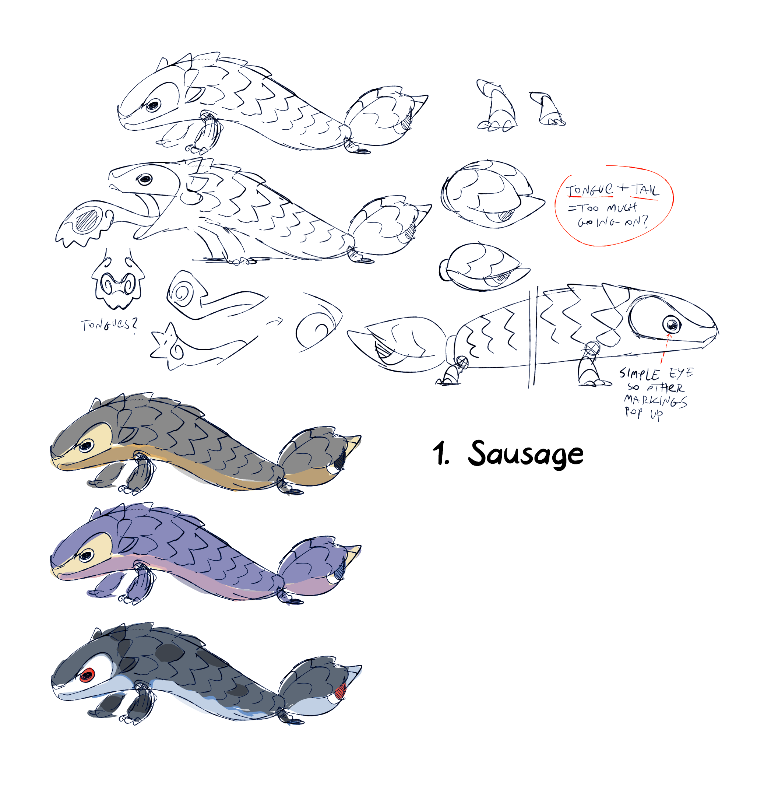
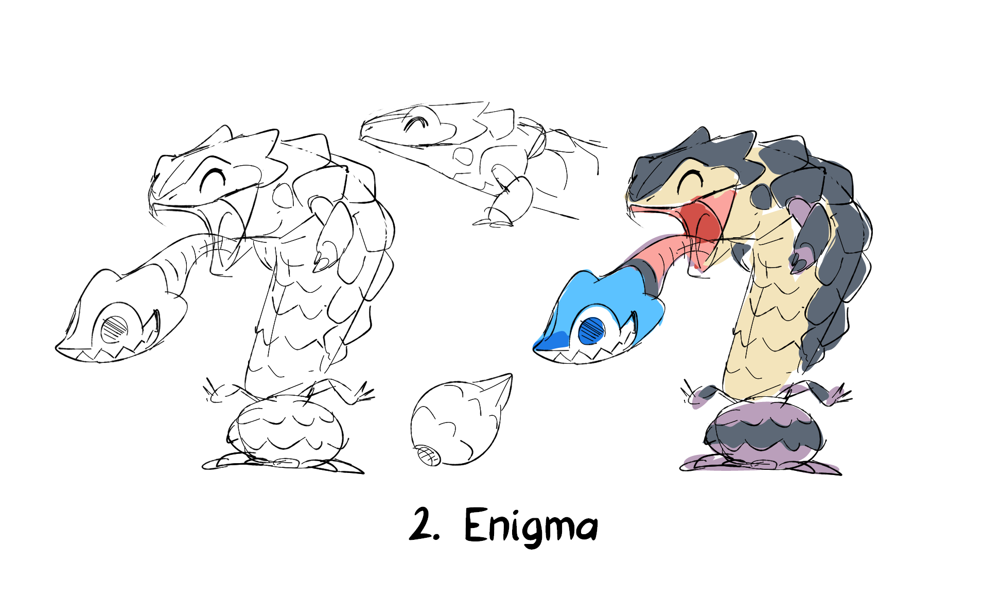
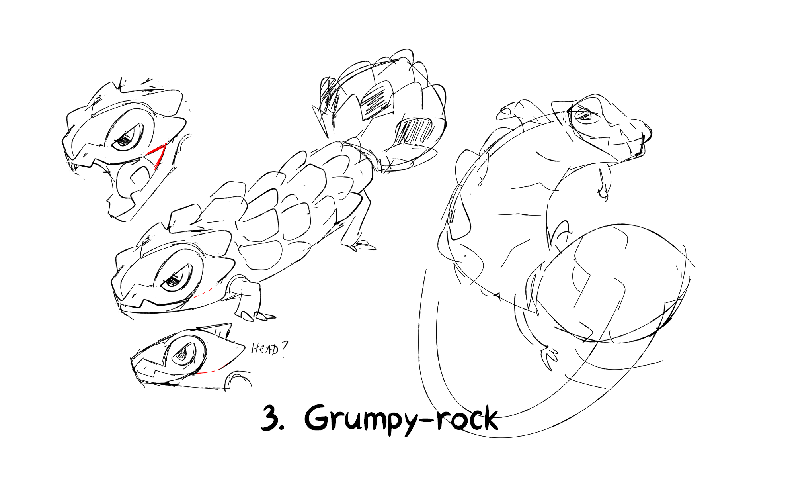
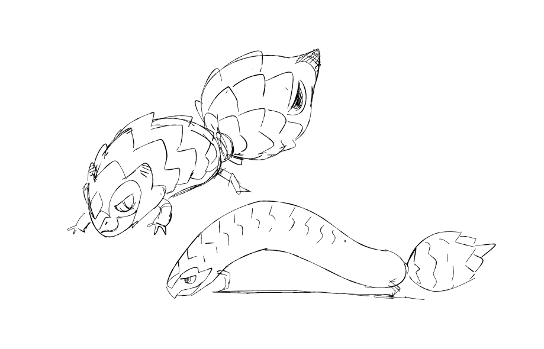
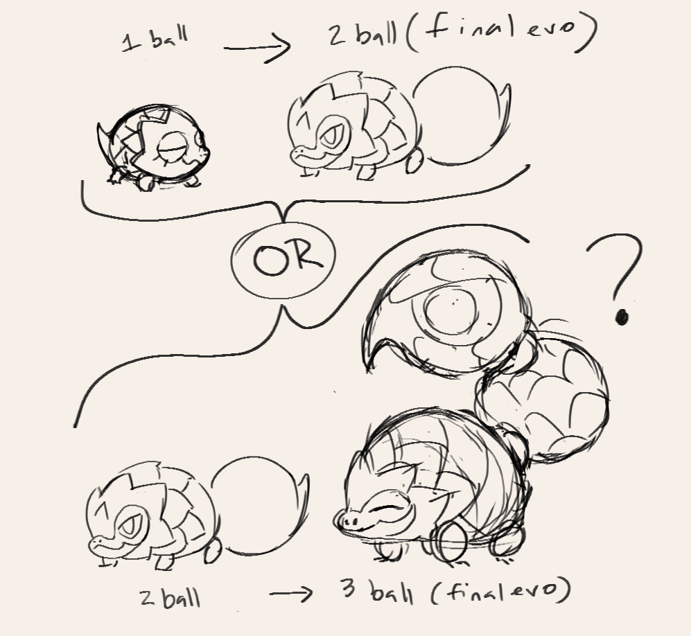
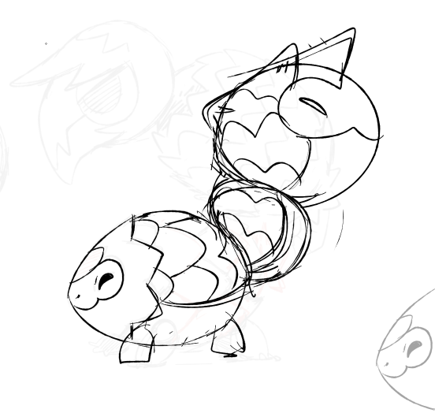
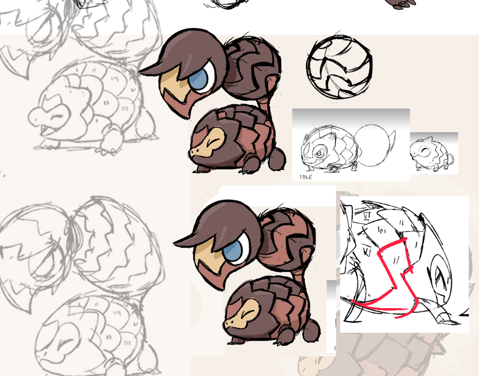
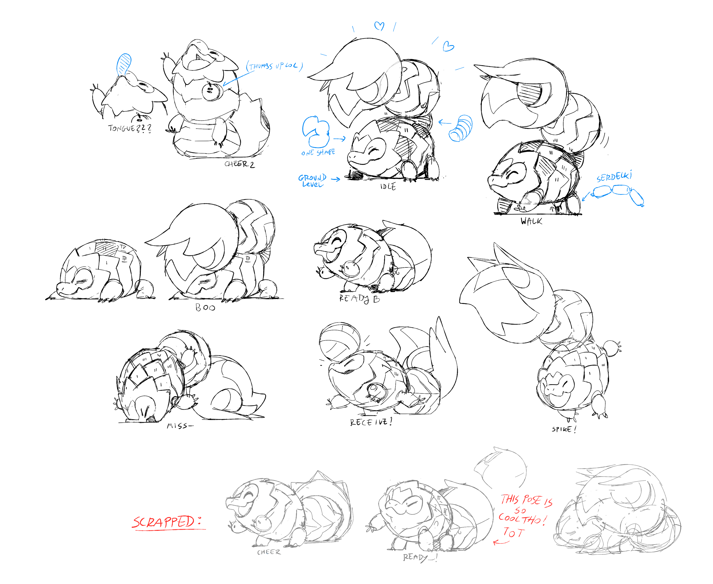

+++
title = "Follow the Shapes (designing Skibble, Skorock & Boldlur)"
slug = "follow-the-shapes-designing-skibble"
description = ""
[taxonomies]
tags = ["archived","beastieball"]
+++

Aside from sketched Beastie stats and playstyles, from early on we had a plan of different environments we needed to fill with Beasties based on where and when players would encounter them. So we knew we’d need a multi-form cave Beastie that players could find early on and grow into something later, possibly inspired by some sort of lizard. That was the prompt Karolina ‘Twarda’ Twardosz ran with when she came to us with these ideas.
<figure><figcaption>July 2022: Various ideas inspired by shingleback lizards</figcaption></figure>
Twarda’s a big fan of lizards and dinosaurs, and had trouble deciding which features of a shingleback to focus on for her designs. On one hand was the distinctive bright blue tongue; an other was the pinecone scale pattern; yet another was the adorable and distinctive sausage-like shape. After putting our heads together, we decided to focus on the decoy face-tail as a central element since it would also be the most obvious implement for playing sports, so there’d be good synergy there. To better emphasize the tail as a decoy, we asked Twarda to try making the head and tail more similar in shape. 
<figure></figure>
And right away we could feel it was working! We started intensely brainstorming what we could do with the poses, switching it up between body and tail and showing off the cute decoy face. We also started considering how we could develop a second form based on this.
<figure><figcaption>Alexis lays out the options before us</figcaption></figure>
Alexis identified two possible directions, with a very geometric theme centered on the count of “ball” shapes; either 1 to 2, or 2 to 3. Laid out like this, we could see that the “3 ball” sketch had a clear theme/pattern to follow, whereas the “1 ball” design was kind of a themeless nothingburger, so we decided to pursue a “3 ball” idea as the additional form for this Beastie.
<figure><figcaption>July 2022: Twarda went off exploring on her own, but Skibble came and found her</figcaption></figure>
Twarda built up a robust pose library for the Beastie that would become Skorock, and during the same period started exploring more shapes for the "adult” skink. Something overtook her, though, because at the same time she posted these poses, she also shared this sketch of an immature form, apologizing that she’d brought this unexpected design home with her, but admitting that she’d already fallen in love with it. And after we saw it, we couldn’t help but fall in love as well.

In general we always put a lot of thought and effort into developing meaningful themes for every single creature; we didn’t want to add designs just to fill up slots in the game, and we didn’t want to add immature/adult forms of existing Beasties that were simply the same idea but smaller, or the same idea but bigger. But every once in a while, that directive was challenged by a cutie like Skibble. Nobody could say no to them, so we decided to adapt it into a 3-stage Beastie.
<figure><figcaption>Skibble!</figcaption></figure>
Skibble came together near instantly, and then Twarda went off to finish developing the final form. But we didn’t anticipate how much it was going to challenge us.
<figure><figcaption>August 2022: It needed something for the body mechanics to make sense...</figcaption></figure>
From Alexis’ sketch, it seemed pretty straightforward to just stack 3 balls on each other and call it a Beastie. The problem was that its body mechanics made no sense. If the tail was meant to be swung or used as a bludgeon, then it needed a joint and some length/leverage it could use to swing; it couldn’t just be a ball stuck to a ball. Twarda came forward with some decent solutions, proposing that we add a medium-length “stem” between the body and tail. But it felt a bit ungraceful and disrupted the geometric harmony established in Alexis’ sketch. Things fell into chaos from here.
<figure><figcaption>August 2022: Madness! Anarchy!</figcaption></figure>
Twarda started exploring what we could do with a limited range of motion, or how we could adapt the size of the body vs. the joint vs. the tail to find a decent middle ground of appeal and practicality. Nothing looked particularly bad, but nothing felt like it was hitting as well as it had in the sketch, and we started to worry the design was simply broken on a fundamental level.
<figure><figcaption>November 2022: Alexis to the rescue!</figcaption></figure>
This was when Alexis came back with a few proposals which satisfied everybody; reduced the number of scales to simplify animation, and a few adjustments to the tail size, joint side, and joint position so that it would be usable but mostly out of the way/hidden by posing. I think this stands as a prime example of the advantages we get from animating our designs in 2D rather than 3D, allowing us to cheat our angles and composition to express exactly the geometry we want players to see, without concerns of a spinning camera.
<figure><figcaption>A big happy skink family</figcaption></figure>
There are a few interesting things about how this design process translated into the game. For one thing, the initial idea which sparked this concept ended up occupying the middle of 3 forms, making it a transition stage which players will usually have the least exposure to. Often with multi-form designs, it’s easy to fall into a trap where the “middle” form is just a boring average between the extreme ends, so I’m glad that we dodged that here. 

Despite being the least high concept of the 3 designs, and indeed the least interesting on a thematic level, Skibble wound up being one of the first Beasties players were exposed to by early marketing materials, with the other forms being a surprise revealed much later. We’ll never be able to experience these designs the way that players did, but it’s always interesting for us to hear from players how the more mature forms surprised, delighted or disappointed them when coming from the early stage. From our perspective, the designs were always going to be like this!

We almost always try to ground our designs in resonant, personality-defining themes. But it was a fun experience to build something from a very geometric concept instead and then fill in the personality in based on that. As the project went on, when certain designs or design features challenged us, this was a technique we sometimes came back to.

Is there a Beastie you’re especially curious to hear about? I’d love to hear from you! Next time we’ll be discussing one that a reader requested :)
