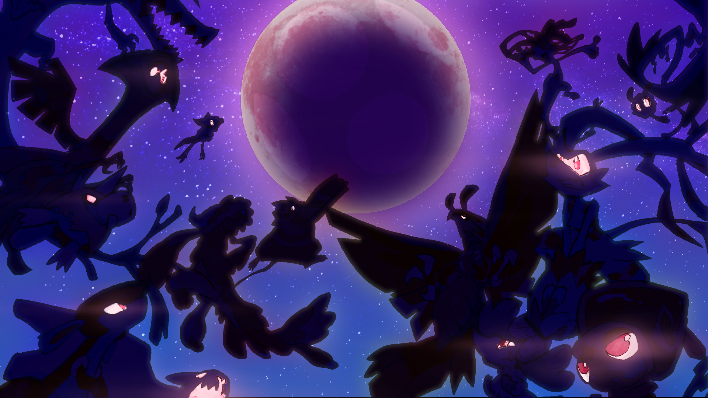
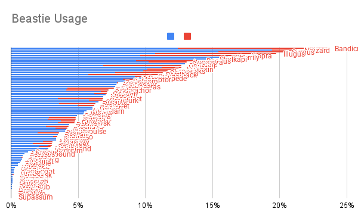

+++
title = "March Open Bash - ALL THE STATS"
slug = "march-open-bash-all-the-stats"
description = "This time, we're providing way more stats then you could possibly want!"
[taxonomies]
tags = ["archived","beastieball"]
+++
<figure></figure>
This weekend we hosted yet another BIGMOON BASH in Beastieball, a timed PvP event! This particular Bash was special for a couple reasons. One, we just released a <a href="https://store.steampowered.com/app/1864950/Beastieball/">pretty big balance patch</a> adjusting a lot of Beasties’ statistics, traits and playbooks. Two, this Bash had no teambuilding theme - players were allowed to use any combination of unique Beasties they wanted! We collected a <em><strong>ton</strong></em> of data from this Bash, and we’re going to share more here than we ever have before!

But first—let’s honor the coaches whose Bash Scores shined brightest.
<h1>Congrats to the Top-Ranked Coaches!</h1><ol><li>
Ket (Bash Score: 3835)
</li><li>
Dino (Bash Score: 3681)
</li><li>
Figgy (Bash Score: 3365)
</li><li>
Zonk (Bash Score: 3276)
</li><li>
Satoros (Bash Score: 3273)
</li><li>
Arc Tech (Bash Score: 3198)
</li><li>
Pyopyo (Bash Score: 3149)
</li><li>
Wallmonger (Bash Score: 3123)
</li><li>
Litt (Bash Score: 3017)
</li><li>
Venn (Bash Score: 2979)
</li></ol>
It’s exciting to see some old and new names in this list! I played in this Bash too, but I could barely crack a score of 2300… Looks like I have a lot to learn from our players.
<h1>STATS</h1><figure><figcaption>What is this… a chart for ANTS?</figcaption></figure>
I know that some players really, really, really like to look at stats after every Bash. So do we! And rather than just report on the top or bottom few Beasties, I figured I may as well just let you all pick through all of it. <em>(Note: Stats are not collected from players who have analytics disabled.)</em>

<a class="button primary" href="https://docs.google.com/spreadsheets/d/e/2PACX-1vQreKe5p7WC09NibNETogHYPVdgw7-9ggy5itVcLfvcMDA4j4wirYskpDm-QA0ao00yysGR0wM7Ny1a/pubhtml?gid=1977434825">Click here for ALL THE STATS!</a>

There’s a few things I want to highlight, reflecting on how this compares to previous Bashes and reflects our recent changes.
<ol><li>
<strong>Spirit offense is on the rise! </strong>We saw a surge in usage for Beasties like Skulkapi, Opposur and Cherrily this time around. With lots of new spirit offense added to the game, it makes sense that players were excited to try out the shiny new toys. But it’s always exciting to see past-neglected Beasties suddenly getting more attention and play.
</li><li>
<strong>Team diversity is higher than ever.</strong> If you compare the top usage stats to <a href="https://greglobanov.substack.com/p/pvp-event-results-favorite-beasties">our first Bash just 2 months ago</a>, you’ll notice that usage is less centralized around the top most popular ones. Of course some Beasties like Bandicraft, Illugus and Noizard are here to stay, but it’s nice to see a closer race between the most popular species.
</li><li>
<strong>Trat, Blitzwift, Musselbound and Grazada are being neglected. </strong>At this point we shouldn’t be surprised to see Blitzwift and Grazada here, but seeing Trat at the bottom of usage was quite surprising. Perhaps all the Trat fans were on vacation this time. Also, interesting to see Hydrolm drop from top 10 in the first Bash to the bottom 5. But 2.74% isn’t dire usage by any means—in Hydrolm’s case, it may just be a sign of how much usage has spread out among many other species.
</li></ol><h1>In the next Bash…</h1>
We’re going to try something a little bit different. There won’t be any Guilds, but <strong>the top 5 most-used Beasties from this Bash are going to be banned! </strong>That means these 5 species:

<em>Bandicraft, Noizard, Surgus, Illugus, Hopra</em>

The date for the next Bash will most likely be <em><strong>April 18-19, in 3 weeks. </strong></em>But I will delay officially announcing the date for a little while, in case anything comes up we need to address on the development/update side. I’m giving you all an early heads up so that you’ll have time to rethink your teams, since this theme is going to impact a large portion of our players. It may be challenging, but I hope it inspires even more creativity :) 

Happy Bigmoon!

