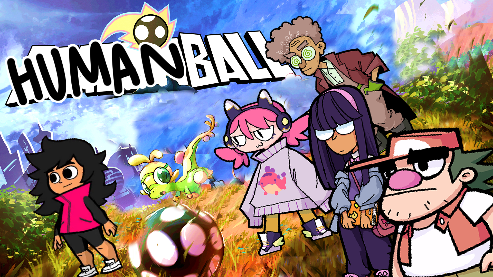

+++
title = "A Beastieball update & an apology"
slug = "a-very-foolish-beastieball-update"
description = ""
[taxonomies]
tags = ["archived","beastieball"]
+++
<figure></figure>
We owe our players an apology. We released Beastieball with a critical issue. In the version we launched with, Beasties played sports and humans coached them. But everyone knows animals can’t play sports… <em>humans do!</em> We’re very sorry for leaving this issue unaddressed for so long. Thankfully, it’s finally fixed.

We’d strongly encourage you to take the time to <a href="https://store.steampowered.com/app/1864950/Beastieball/">check out the game</a> or <a href="https://store.steampowered.com/app/2404130/Beastieball_Demo/">the free demo</a> today and enjoy Beastieball as it always should have been.

Happy April Fool’s Day!

