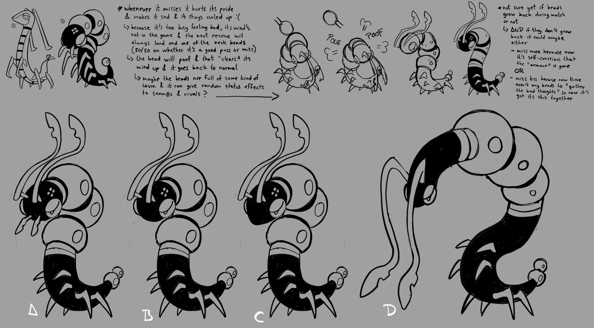
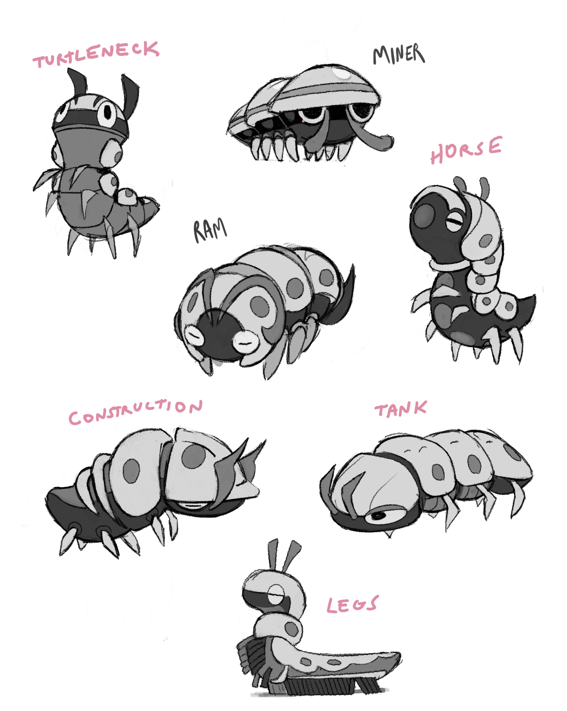
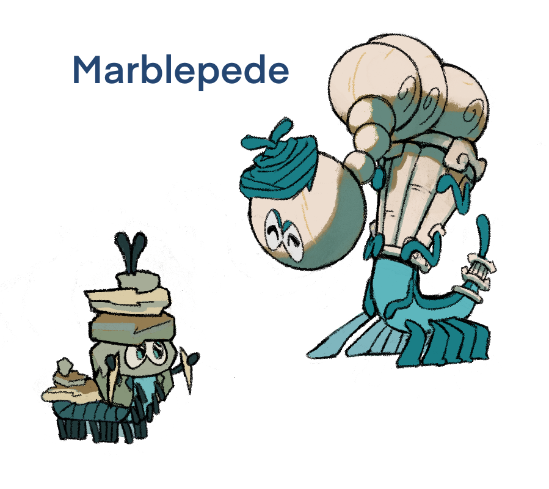
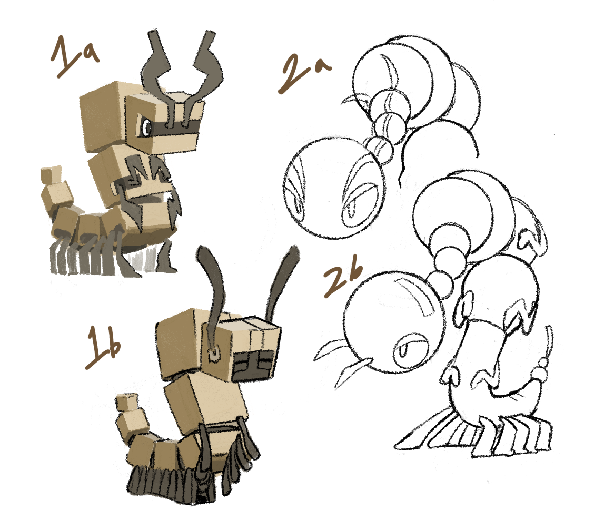
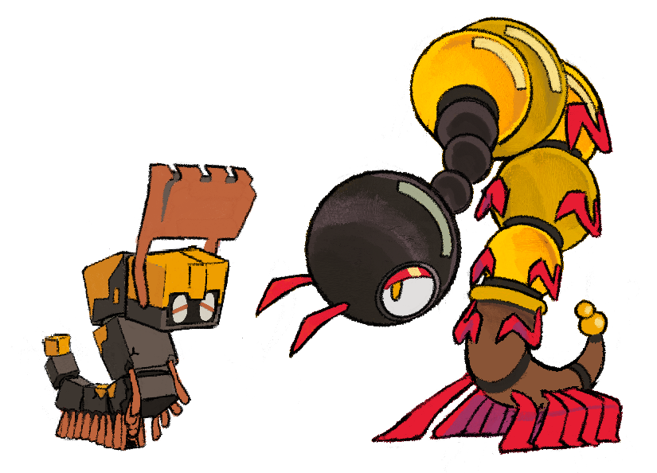
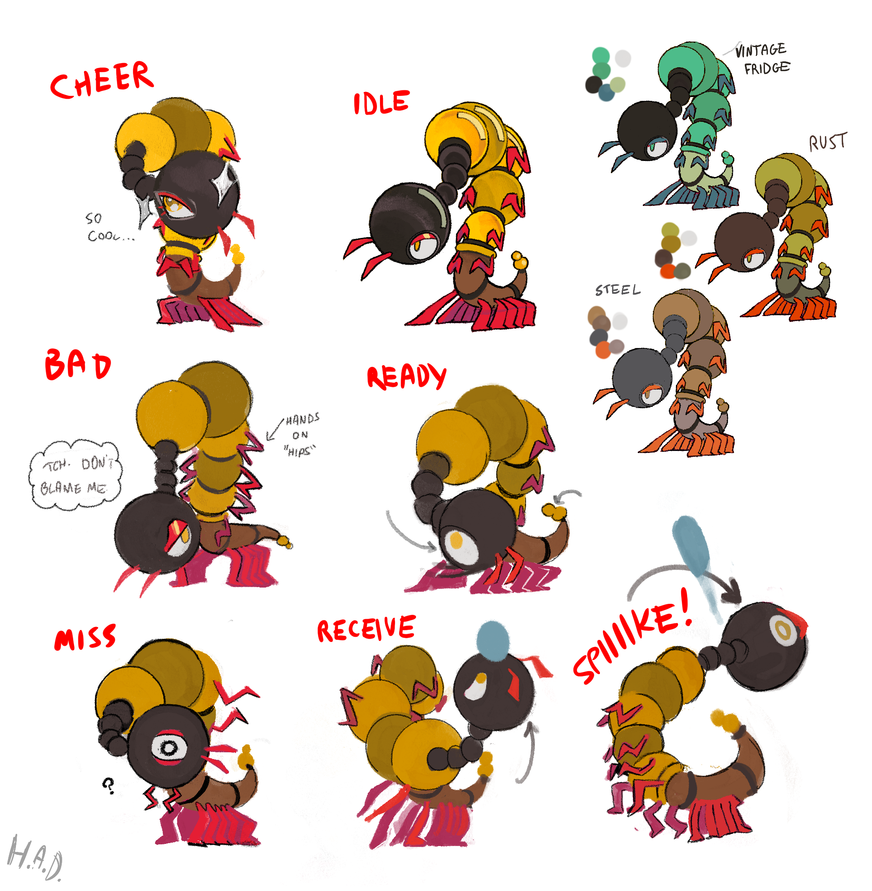
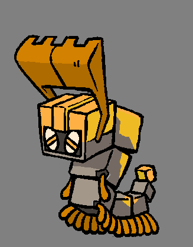
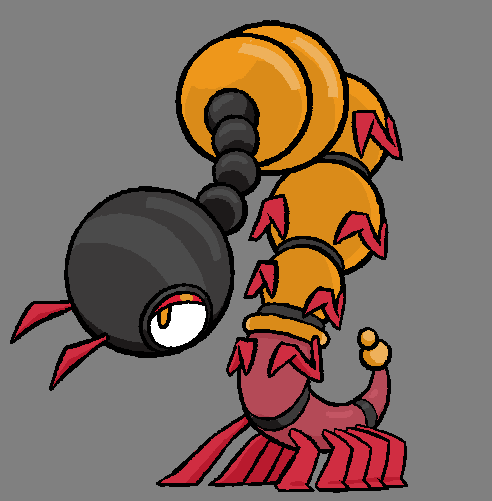

+++
title = "Constructing a Theme (designing Demolipede & Millimine)"
slug = "deconstructing-a-vibe-designing-demolipede"
description = ""
[taxonomies]
tags = ["archived",]
+++

I think it’s no secret that I’m a pretty big fan of the volleyball anime, Haikyu. Several of our early concept prompts were ideas inspired by characters in the show, particularly in the ways they tied playstyles to personas. And one that we really wanted to explore was a tall blocker inspired by <a href="https://www.pinterest.com/pin/9077636737519989/">Tsukishima.</a>
<figure><figcaption>April 2022: Karen’s first exploration of ideas</figcaption></figure>
Now, Karen Centella hadn’t actually <em>seen</em> Haikyu, but they studiously watched some YouTube videos and sketched some starting ideas. For some reason nobody really could put into words, we all gravitated to design #7. It had nothing to do with the inspiration… it just had its own natural charisma to it and we all wanted to see more. The main issue I was having with it was its awkward shape; for something meant to be a blocker, its arms couldn’t actually reach up high, and its spherical upper body “beads” (we didn’t even know what they were) would deflect balls in unpredictable angles. We encouraged Karen to explore that design more, but thinking more about its practicality.
<figure><figcaption>May-June 2022: Experimenting with an immature form, armor, anetenna, arms, and other ideas</figcaption></figure>
Karen tried a lot of ideas, pulling from any inspiration they could find. We honed in on some species of pillbugs as potential real-world inspirations. But nothing was quite working. We really, really liked the original silhouette from “design 7” (Alexis particularly). But we couldn’t come up with any explanation for it to have those strange, distinct spherical shapes on it. And every alternative idea and shape that Karen explored to help it feel more grounded seemed to compromise the original drawing’s appeal. We couldn’t find a way to resolve it.
<figure><figcaption>July 2022: We settle on a strange balloon-bead idea</figcaption></figure>
After all our exploration, we still most liked the original “design #7”, so we decided to just go with it as the final and make only minor modifications. In our struggle to explain why it looked like that, Karen pitched quite an elaborate game mechanic idea where their beads could inflate and deflate. The game mechanic wasn’t very usable, though. In fact, the entire original idea that had prompted this design didn’t really fit what we wound up with at all, as we’d never been able to make them look like an effective blocker. We couldn’t really explain what inspired this shape, or why they were like that… but Alexis liked it a lot and fought to keep it in the game at all costs. 

This was where I charted out a new game design for them, with a trait called <em>“Watchtower”</em> that emphasized their appealing eyes and tall form. We figured it might have some sort of Mind or Spirit-type flavor, and with its strong facial expression, that would hopefully be enough to make it work as a Beastie. 

Later, as we were deciding where in the world different Beasties would appear, we clocked this one as having strong potential as a cave-bug. This introduced a challenging new wrinkle, as caves appeared pretty early on, and as such anything that appeared in caves would probably need more than one form to mature through. Already our lack of a strong design direction was coming back to haunt us. So, faced with the challenge of designing a second form without any clear theme or inspiration to work from, we decided to pull in our resident insect expert.
<figure><figcaption>January 2023: Harlow offers ideas for an immature form, and shares sketches of a similar idea she'd worked on years prior</figcaption></figure>
Enter Harlow Diggs, whose past experience with entomology had proven a strength on our team time and again. She identified <a href="https://en.wikipedia.org/wiki/Pauropoda">pauropodas</a> as a potential insect to draw inspiration from and offered a few ideas, and shared some very old sketches she’s done trying to adapt the same insects before. There were tons of ideas here with great appeal. But without any theme tying the ideas together, nothing really felt like it had any connection to the tall millipede they were based on. 

This was where I took a step back, assessed everything we had, and made a fairly radical proposal to try to resolve all our different explorations.
<ol><li>
With the adult’s sphere-inspired geometry being such a huge component, we needed to exaggerate the shapes on the immature form a lot more as well. I wanted to find a clear progression from the immature form’s base shapes to become spheres in the adult. After all, we’d seen before that <a href="https://open.substack.com/pub/greglobanov/p/follow-the-shapes-designing-skibble?r=n5vx5&amp;utm_campaign=post&amp;utm_medium=web&amp;showWelcomeOnShare=true">geometry itself could be a solid starting point for design themes.</a>
</li><li>
Harlow’s new ideas included some mining and construction inspired ideas. What if we rolled with that, and rebranded the sphere-focused adult as a “wrecking ball”?
</li></ol><figure><figcaption>February 2023: Harlow rethinking the immature and mature form together</figcaption></figure>
We all loved Karen’s design, but with their blessing, Harlow opened it back up and started messing with it to see how they could pair it up with a new immature form. She honed in on a “rough stone” to “polished stone” concept to rationalize why the adult was made of spheres. Developing the ideas side by side like this really helped us work out theming at this stage. This was where I pulled up Harlow’s oldest pauropoda sketches and highlighted a particularly cube-shaped one, asking if we could use that idea for the immature form here, since “cubes to spheres” would be a really satisfying geometric character/visual arc.
<figure><figcaption>February 2023: Harlow figured out the shapes and leans into \&quot;construction\&quot; inspired colors</figcaption></figure>
I don’t know if the idea clicked for the rest of the team, at least at first, but all the pieces snapped into place once we saw the designs side by side. Harlow pushed into yellow-and-black for the color palette, emphasizing the “construction” theme and codifying this Beastie’s in-game role as a Body type. Somehow, we’d found a way to explain the bizarre shapes of Karen’s original concept, injecting a theme into it without disrupting what had made it so appealing in the first place. It was a huge win. This was where Alexis suggested that we augment the immature form’s antenna to take inspiration from dirt pushers, to solidify their role as an earth-mover that teamed up with the wrecking ball adults.
<figure><figcaption>June-July 2023: Harlow finalizes the designs and works out pose charts</figcaption></figure><figure><figcaption>Final in-game designs by Alexis</figcaption></figure>
I think something we firmly established from this experience was how important it is to have a theme for every Beastie. Beastieball’s “types” are a lot more broad than in other creature games, and that gives us a lot less slack when it comes to conveying ideas through our designs. For example, you might be able to combine a specific lizard species with “fire,” and develop a fairly specific-feeling creature from the combination of those ideas. But taking any animal and combining it with a “mind” theme rarely turns into anything inspiring. It puts the onus on our creature designers to always go a layer deeper and make the designs really resonate with strong visual theming that stands on its own merit, rather than relying on our types to convey everything for us.

Coming up with new themes is really hard sometimes. It can even feel pointless or painful when we have a design we love but that falls apart when we try to attach a theme to it. But we’ve found the result is always worth it. And I think that even in creature games that have a stronger “type” system to lean on, the designs are only truly great when they go beyond the obvious and develop their own strong internal logic. The lack of easy solutions for us only helped us to learn that lesson faster.

Let me know if you’re curious to learn more about a particular Beastie! 

