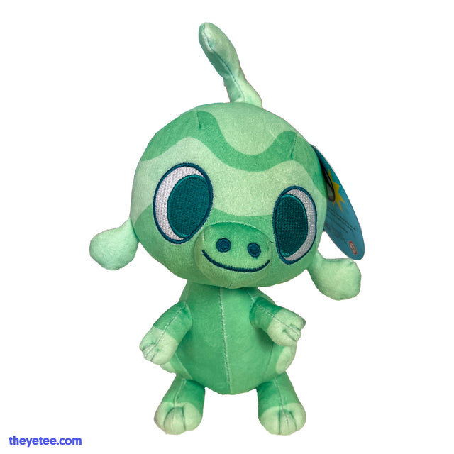
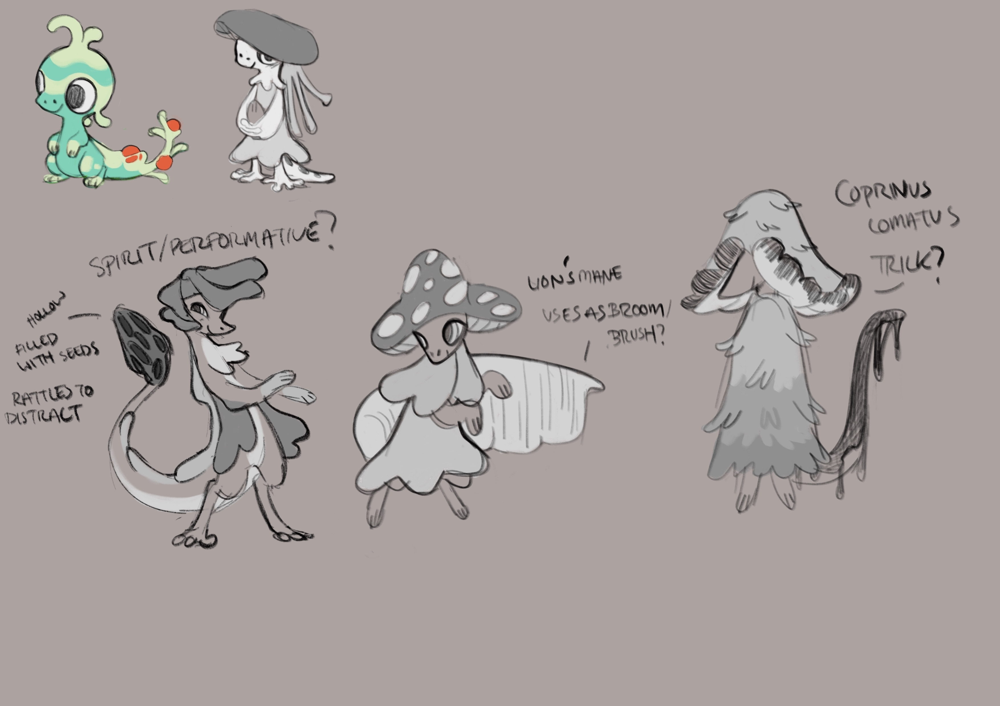
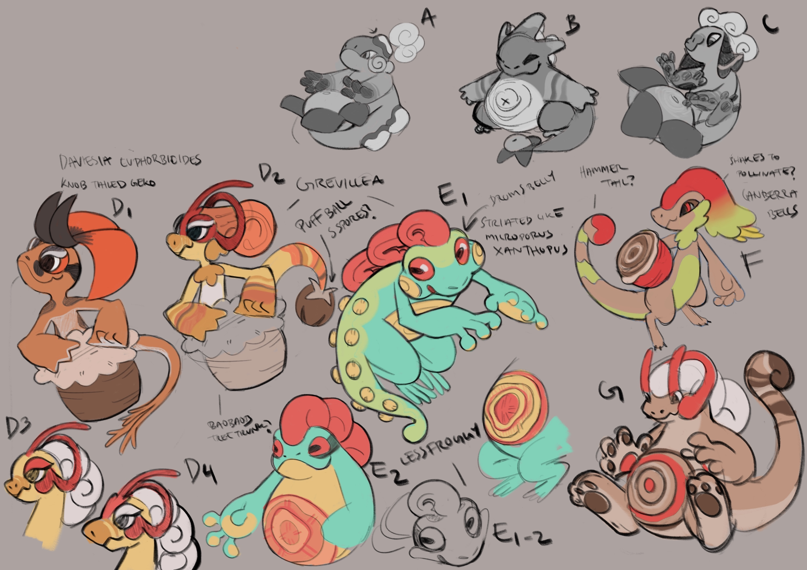
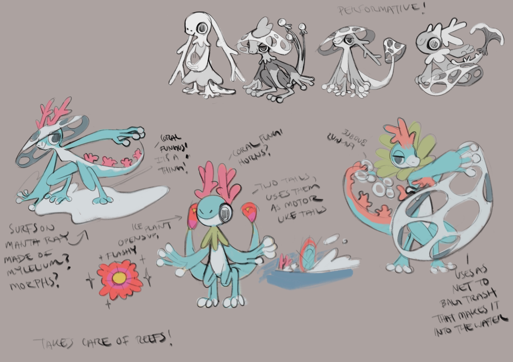

+++
title = "Expand and Contract (designing Sprecko + forms)"
slug = "expand-and-contract-designing-sprecko"
description = "Also: sprecko plushies are coming soon!"
[taxonomies]
tags = ["archived","beastieball"]
+++
<figure></figure>
Before I start this newsletter, an exciting announcement! <strong><a href="https://theyetee.com/collections/beastieball/products/sprecko-plush">Sprecko plushies will be available for sale one week from today at the Yetee!</a> </strong>This is a limited stock of extras we had after our Kickstarter campaign, so we wanted to make sure everyone who wanted one had a chance to plan in advance. <a href="https://theyetee.com/collections/beastieball/products/sprecko-plush">You can enter your email on the store page to be notified as soon as it goes live.</a> It should be in one week, at 8AM Pacific Time on Friday, April 18.

In honor of Sprecko, here’s a dive into the process we went through in designing them as well as their various forms!

When ideating the Beasties players would start with, we developed a pretty lengthy wishlist for the Beastie that would become Sprecko.
<ol><li>
It <strong>had</strong> to be broadly appealing; every single player got to choose one Beastie they started with, but they would always get this Beastie as their 2nd, so it needed to be easy to like.
</li><li>
It needed to have the potential to become many different forms based on the players’ decision later, to make up for the fact that they had no say on it initially.
</li><li>
Fitting with the game’s overall themes, we wanted a creature that was nature-inspired, perhaps a nature spirit or a caretaker of some kind.
</li></ol>
This was a huge ask; before this design was even started, there was pressure on it to carry the game’s themes while also appealing to every single player. I figured we would probably need to adjust our plans later or compromise on some things in the process. Despite the daunting ask, concept artist ToriDomi jumped right in and started exploring all the directions they could think of.
<figure><figcaption>March 2022: Tori’s first exploration</figcaption></figure>
There were a lot of intriguing ideas right out the gate; nothing really rang like “this is it!,” but almost everyone agreed that there was something striking about the mushroom-inspired visual design Tori had tried in a couple designs. We started sharing pictures of different strange mushrooms and started theorizing on how designs could be inspired by them. Tori went off and aimed to dig deeper on a couple ideas that stood out more than others.
<figure><figcaption>March 2022: Tori’s second pass</figcaption></figure>
Even amidst all the ideas on this page, this was when a lot of the team came together and agreed that “C2” had something special going on. The only thing nobody could decide on for themselves was whether they liked the hat full of holes; it looked complex, and a bit scary. But its contrast with the chibi monster was also what made it appealing. We didn’t know what to do with it, but we told Tori to go and make more of it.
<figure><figcaption>April 2022: It’s Sprecko!</figcaption></figure>
And that’s when all the ideas that would be combined into Sprecko finally emerged. On first impression, almost everybody liked the leaf-hat idea, but as we sat with it for longer, we decided the “sprout” head fit best. It was the perfect mix of conveying immaturity, while being a bit weird, but still very simple. By adding berries to the tail, we could create a complex and colorful focal point to add just a bit of flavor to an otherwise plain design. Alexis took the reins from here, making some tweaks to the proportions and bringing Sprecko to life.
<figure></figure>
Now Tori just had to come up with 3 different forms, inspired by 3 different field effect game mechanics we’d already implemented. My message to Tori at the time:

good luck lol

<figure><figcaption>May 2022: Tori threw all these ideas out at once</figcaption></figure>
Discussing 3 Beastie designs at the same time was exhausting, but it did help us to clarify what made each of them distinct, and helped us to push each one in a unique direction. From early on I appreciate how willing Tori was to be playful with the silhouette and body shape, offering designs that were all over the place in personality. I think the seeds of each design were firmly planted from these first sketches, although they each still had a ways to go.
<figure><figcaption>June 2022: Tumbling down the rabbithole</figcaption></figure>
Rather than honing in on what was working, Tori went even more broad! Chatter was flying about all the parts we liked of different designs, trying to piece together what we wanted to carry forward. The designs were so all over the place they didn’t feel strictly related. What we needed was a way to tie them all together. 

We did eventually figure it all out… but that story will have to be for another newsletter! I’ll see you next time in part 2.

