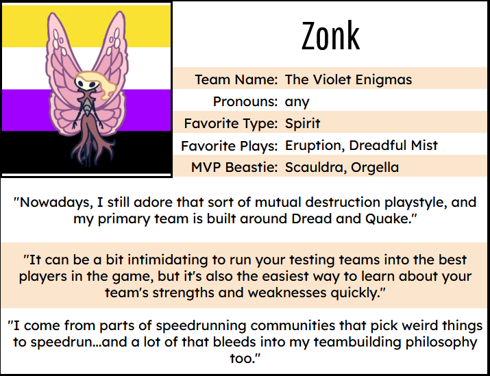
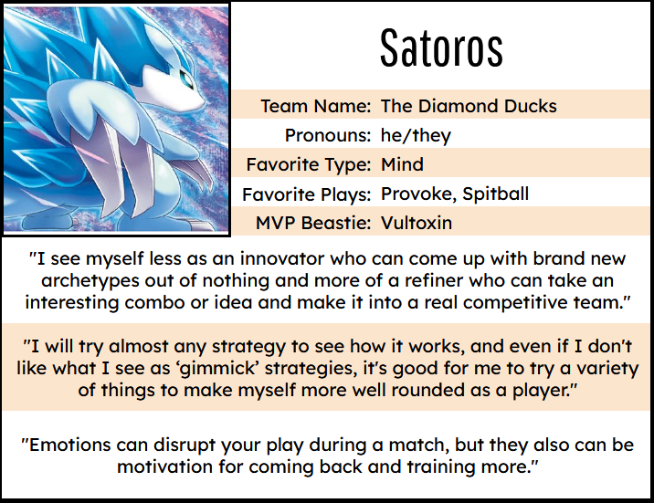
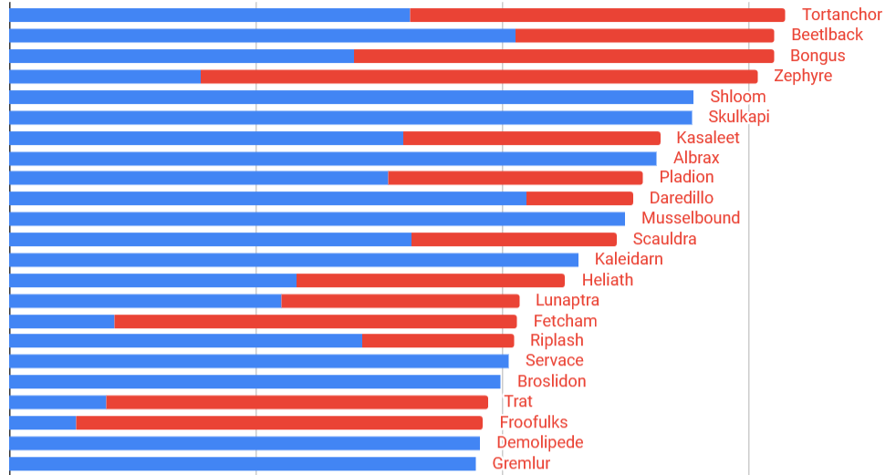

+++
title = "April Bash Results! Top Coaches & Stats!"
slug = "april-bash-results-top-coaches-and"
description = ""
[taxonomies]
tags = ["archived",]
+++
<figure></figure>
This past weekend we hosted another BIGMOON BASH in Beastieball, where coaches could challenge one another in fierce contests of sport! 

For this Bash, we BANNED the top 5 most-used Beasties from the previous Bash, which meant there was no Bandicraft, no Illugus, no Noizard, Surgus or Hopra! Here are the coaches who came out on top in the unconventional meta that remained.
<ol><li>
<strong>Zonk (The Violet Enigmas)</strong> | <em>Bash Score: 3108</em>
</li><li>
<strong>Kim (The Happy Hearts)</strong> | <em>Bash Score: 2980</em>
</li><li>
<strong>Arc Tech (The Arcane Machines)</strong> | <em>Bash Score: 2916</em>
</li><li>
<strong>Satoros (The Diamond Ducks)</strong> | <em>Bash Score: 2892</em>
</li><li>
<strong>Rosery (The Roaring Knights)</strong> | <em>Bash Score: 2860</em>
</li><li>
<strong>Ket (The Lonesome Lovers)</strong> | <em>Bash Score: 2848</em>
</li><li>
<strong>Kyyg (The Wacky Worms)</strong> | <em>Bash Score: 2828</em>
</li><li>
<strong>AshleyETA (The Musical Girls)</strong> | <em>Bash Score: 2816</em>
</li><li>
<strong>Figgy (The Spicy Spies)</strong> | <em>Bash Score: 2804</em>

<strong>Knight (The Newborn Lights)</strong> | <em>Bash Score: 2804</em>
</li></ol>
Congratulations to these coaches! Many of these players are active in our <a href="https://discord.gg/VUcsuU8SRC">community Discord</a>, often swapping strategies and team ideas. In fact, kim of the Happy Hearts <em>(this Bash’s #2 player!)</em> recently took it upon herself to start interviewing active community members to learn more about their angle on the game and teambuilding. Here’s a little bit of insight from some of the above coaches…
<figure></figure>
You can see more player interviews in <a href="https://docs.google.com/spreadsheets/d/1L6-5L9Nwg8uqyYatoQtAC7bjp2JUuj9hOXxqm9v0unw/edit?usp=sharing">kim’s spreadheet here!</a>
<h2>Usage Statistics!</h2><figure></figure>
With the top-used Beasties all missing, we saw quite a different palette of teams emerge this time around! We’ve got all the stats here for PvP Sickos to peruse through.

<a class="button primary" href="https://docs.google.com/spreadsheets/d/e/2PACX-1vTsCMQWhE2m7XREiEMCR48WgPD5PGVCH8X0YF6wlUmuhphNqnjAyTj28Ao7acXverkA-x-LeXuUS0Ae/pubhtml">Check out ALL THE STATS!</a>

I want to give a shout-out to some of our more active community members, who keenly noticed that their specific team compositions were missing from previous Bash stats. Thanks to them, we uncovered underlying issues with how our data was collected—it turns out, we were missing data from about half our players! As such these stats are much more representative than we’ve ever had before… a huge gift for us on the balancing team (phew!) and for our community who love to look at all the juicy numbers. We’re still working on recovering data from previous events; when we do, we’d love to share updated historic data on those with you!

In the meantime, a few insights from me looking at the usage stats in this event:
<ol><li>
<strong>Captains still reign supreme! </strong>With Bandicraft absent, other Captain Beasties (Tortanchor and Beetlback) took their place in top usage. Captain is just THAT handy to build around! 
</li><li>
<strong>Many more Beasties got to thrive this time! </strong>The top-used adult Beastie (Tortanchor) was used only ~7x more often than the least-used one (Grazada). We may never see such an even distribution between every specie in a future event again! Players really showed off their creativity this time around and discovered tons of new combos and ideas, which is exciting to see <em>(and a bit daunting as we play whack-a-mole with balancing it all… ha ha…)</em>
</li><li>
<strong>The most underrated Beasties included Grazada, Pladion, Magpike… and Collarva?! </strong>I don’t know who brought Collarva to those high-ranking games, but kudos to you, whoever you are! You’ll probably never attain that player’s godlike skill level, but you may get closer if you try using some of those other Beasties that high-skill players gravitate to.
</li></ol>

That’s all for now! We’re getting our calculators and nerf-hammers ready as we prep the next balance patch with all this data in hand.

Thank you to our players and community for your devotion to this game. It’s really an honor to get to make something that so many people put so much of themselves into. See you in the next Bash!

