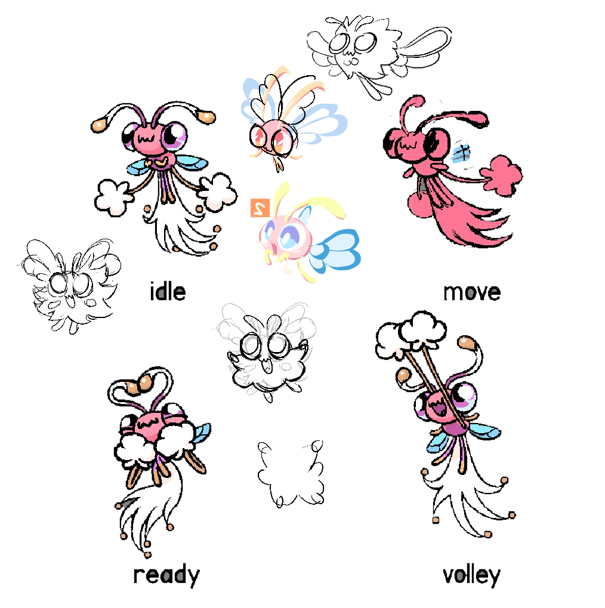

+++
title = "Creating with Hearts and Brains (designing Cherrily and Merrifly)"
slug = "creating-with-hearts-and-brains-designing"
description = ""
[taxonomies]
tags = ["archived",]
+++
<blockquote>
<em>cheerleader bug fairy - colorful, small, has pom-pom like shapes on its hands! frail bug with very powerful support abilities</em>
</blockquote>
This was the concept prompt we sent to Ivan Freire for what would become Cherrily! Ivan is a really fun and interesting fellow - <em>he</em> initially reached out to <em>us</em> asking if he could do concept work with us, and as fans of <a href="https://store.steampowered.com/app/1422420/Dodgeball_Academia/">Dodgeball Academia</a> <em>of course</em> we had to say yes!
<figure><figcaption>March 2022: Ivan had so many ideas. So many!!!</figcaption></figure>
It’s fascinating to see how differently every artist worked. Ivan hit us with sketch after sketch, all with their own merit and appeal. There was so much to appreciate, but it was also daunting to sift through, compare and discuss them all.

As we advanced through sketch phases, something we wanted to emphasize were more elements inspired by specific insects, trying to create something that felt more naturalistic and less caricatured/cartoony, the way Ivan’s style bent. Ivan’s jolly character designs all had the right energy, but Alexis soon realized we needed some way to filter down all of the ideas into something cohesive. She wanted to find some single specific bug species that we could center the design on, using elements from Ivan’s sketches to inform the character. In our search for possible pom-pom wielding inspirations, we considered <a href="https://en.wikipedia.org/wiki/Pseudoscorpion">pseudoscorpions</a> and even <a href="https://reefbuilders.com/2016/11/08/invertebrate-highlight-the-pom-pom-crab/">pom-pom crabs</a>.
<figure><figcaption>April 2022: Alexis has an amazing ability to step away, deeply internalize a complex conceptual problem, and then tie it all down… she never ceases to amaze me!</figcaption></figure>
This was what Alexis came back with after a period of contemplation, and right away we could all feel that it had been “solved.” She chose to focus on <a href="https://en.wikipedia.org/wiki/Eriosomatinae">woolly aphids,</a> very small bugs who suck sap from flowers and spin it into a cotton-like cloak. The idea to reframe this as a cheerleader pom was pretty galaxy brain, not to mention the way she navigated Ivan’s ocean of ideas to bring together many of the most appealing individual details — the OwO face from one drawing, the head/body ratio of another, the use of long, gangly arms and dangly shapes from yet another. Where the rest of us had been stuck deciding which design to explore more deeply into, Alexis found a way to pack all of Ivan’s iterations into one!
<figure><figcaption>April 2022: Ivan claps back</figcaption></figure>
With the design honed in a lot more, Ivan really showed his chops, taking Alexis’ concept and turning the personality up to 11. It took Alexis’ smarts to tie all the pieces together thoughtfully, but Ivan’s distinct linework and over-the-top character performance was what made Cherrily come to life. I love how, even though we’d given artists a pretty specific selection of poses we needed for each Beastie, Ivan always drew tons of extras. You could feel his intense desire to explore the Beastie’s personality through expressions and poses, way above and beyond what the game required.
<figure><figcaption>Cherrily as they appear in-game! They were one of the very first Beasties we brought to animation, as we felt they perfectly expressed the game’s unique mix of “sports” and “creature.”</figcaption></figure>
We knew from early on that we’d want to make an immature form for Cherrily as well, since it seemed so straightforward to take the design and make a cute baby version of it, possibly even drawing from Ivan’s existing body of sketches. Eventually, Irischroma decided to pick up the torch and take some passes on the idea.
<figure><figcaption>March 2023: Irischroma tries some fairy ideas</figcaption></figure>
Boom! Done! Easy! Or so I thought, anyway. It seemed like there were a few pretty obvious ways to turn Cherrily into a baby and I felt Iris had nailed it here. And I think on many other productions, this is where it would have ended. But Alexis was dissatisfied with these concepts for reasons she had trouble articulating, sitting on these for an extended period while she brainstormed what she wanted to do.
<figure><figcaption>2023??: I found this in a folder somewhere; I don’t think Alexis ever sent it to anybody, but it shows where her head was at.</figcaption></figure>
Alexis wasn’t content to go down the “obvious” route—partially because, with the design so simplified, it made Merrifly into a generic looking fairy without any clear insect inspiration. Alexis wanted to keep the design grounded with specific real-world animal characteristics and references. Her thought was to keep the woolly aphid wool as a key design element, turning the creature into a sort of jolly dustmite. But it still felt too nonspecific, and she couldn’t resolve it.
<figure><figcaption>November 2023: Dandelion seeds!</figcaption></figure>
Eventually Alexis and Irischroma sat down together for a big brainstorming session, and this art was the result of it—Iris took in Alexis’ ideas and spruced it up with their own amazing sense of personality and flow. The key idea that cracked it was to take inspiration from dandelion seeds, which aren’t technically related to woolly aphids at all… but they provided the perfect theme to tie down all the ideas we’d had. After experimenting with different ear, arm and wing shapes we all agreed that the simple top-right sketch design was the one.
<figure><figcaption>Going against convention, we skipped doing pose sketches, and Alexis simply drew clean final poses in her first pass. This design wound up being very special to her.</figcaption></figure>
As someone who tends to design characters in a very fast-and-loose way, it always amazes me to reflect on all the tiny invisible decisions that get made in the design process, and to see all the iterations that you can do on something that seems so simple. I really want to give Alexis kudos here on her skill as a creature designer; I’m still learning from her every day on this project.

