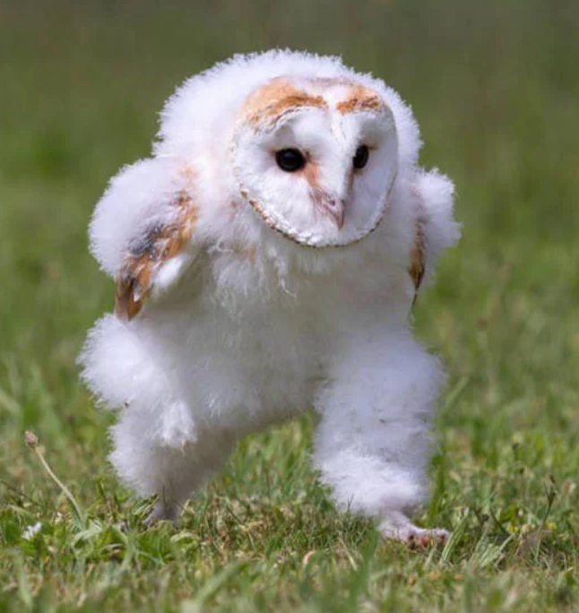
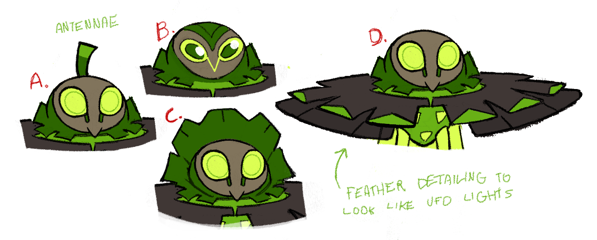
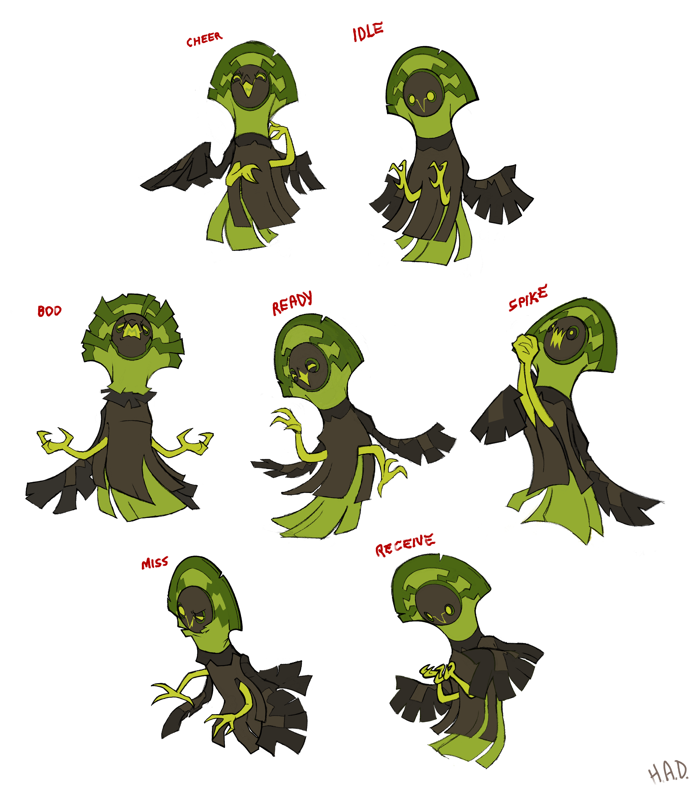

+++
title = "The All-Important Third Thing (designing Albrax and Yueffowl)"
slug = "a-myth-reimagined-designing-albrax"
description = ""
[taxonomies]
tags = ["archived",]
+++

As we got late into production, our priorities in concept designs shifted. We asked concept artists who had stuck with us for a long time to pitch their own ideas to us; what’s an animal or concept that they had dreamed of, but never got to do?

That’s when Harlow dropped Albrax on us, basically fully formed from the first concept sketch.
<figure><figcaption>December 2023: An invader from another world appears!</figcaption></figure>
Harlow has long been a fan of cryptids and urban legends, with a particular soft spot for <a href="https://en.wikipedia.org/wiki/Flatwoods_monster">Braxie, the Flatwoods monster.</a> This Beastie clearly had been waiting, dormant, inside Harlow. 

In Harlow’s words: <em>“There are few cryptids as visually iconic as the Flatwoods Monster. It's a small wonder that it regularly appears in video games with its design largely unchanged. I've done a few Braxie influenced pieces before (and will certainly do so again) but a simple iteration would not do for a beastie concept. I wanted to take what I love about the Braxie sighting and evoke it rather than simply reference it.”</em>

And <a href="https://buginacup.tumblr.com/post/767176547407953920/really-glad-to-see-your-writeup-on-the-collarva">from her blog</a>: “<em>The barn owl portion stems from the general suspicion that the Flatwoods Monster sighting was a misunderstood scuffle with a barn owl (along with various other things). The idea of the line was to try and illustrate the way one thing can seem like another - and also to make a badass cool alienbird.”</em>

<em>“To round out its visual design I used a lot of geometric angles to distance it from more naturalistic bird designs, and themed it vaguely around avocados - it kind of emerged looking like an avocado and it was a fun "third thing" to crowbar the design into its own identity.”</em>

I want to highlight Harlow’s mention of a “third thing” here, because it’s a guideline we independently stumbled on when coming up with <a href="https://greglobanov.substack.com/p/how-we-name-beasties">our pillars for a good Beastie name</a>, and I believe it’s a rule with wide application. Mashing any two things together is a surefire way to make something new, but often the components are obvious and the result is ungraceful. Adding a “third thing” is what can take a concept to the next level, and when it works, it imbues everything with a deeper and richer meaning. Ideally the third thing should be something that resonates with the other 2, but as we see with Albrax, even when it’s something fairly random—like an avocado—it still gives the design a strong leg to stand on.

With so few slots remaining for new designs, we never intended to move forward on the “baby” idea Harlow had sketched beside Albrax. But when we got to pondering what the last 3 or 4 designs in the game would be, Alexis did a month-long reassessment of every Beastie we had, trying to identify all the gaps that could still be filled. And one thing she uncovered was that there weren’t any unique birds in the early areas of Mythwood. Another thing she uncovered was that we had an overabundance of “round” Beastie designs, and not enough pointy/spiky ones.
<figure><figcaption>Alexis particularly wanted to emphasize the strange shape of owl's legs to make something that felt a bit alien and bizarre.</figcaption></figure>
With this data in hand, we came to Harlow with a request for an immature form of Albrax that had gangly long legs and a non-round design. We were so excited to realize the idea, we had the name Yueffowl ready to go before the first sketch was even started <em>(first draft names: Leggstraterrestrial, Hooteffo)</em>.
<figure><figcaption>April 2024: Lightning strikes again</figcaption></figure>
Again, Harlow nailed it on the first try. In her words: <em>“While Yueffowl definitely still has the iconic barn owl face, <a href="https://en.wikipedia.org/wiki/Vogelkop_lophorina">lophorinas</a> obviously inspired its posture and wing shape. It’s too perfect not to do!”</em>

I think it helped that, at this point, we had been working together and on this game for more than 2 years. After many trials and tribulations, impossible design challenges, crushing failures and difficult victories - we’d perhaps hit our stride designing Beasties, just in time to be finished with the whole ordeal.
<figure></figure>
Harlow also took charge of designing the poses for these two Beasties, both of which were obviously quite precious to her. Something new she started doing around this time was roughly modelling her Beasties in 3D, as a way to create a quick reference for different poses and view angles. 

And - that’s how Albrax and Yueffowl were designed! It was refreshing to have a couple that came together this easily. 

If you’re curious to learn about any other particular Beastie designs - let me know! See you next time!

