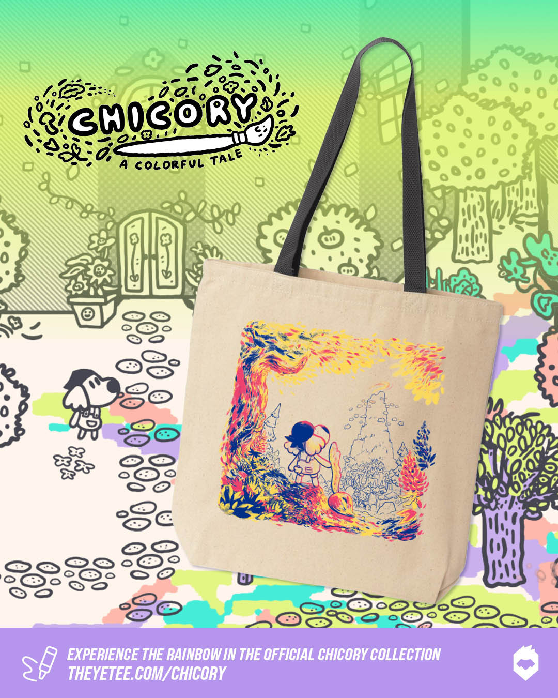

+++
title = "Chicory 4-year anniversary + Tote Bag!"
slug = "chicory-4-year-anniversary-tote-bag"
description = ""
[taxonomies]
tags = ["archived",]
+++

It’s been almost 4 years since Chicory first launched on Steam and Playstation… At the time I recall there was a powerful anticipation for the game within our niche little community. But we couldn’t have foreseen just how large its impact was going to be and the kind of response it was going to get from players during a difficult pandemic year in 2021. 

It’s still pretty mind-blowing to look back at the accolades it received. <a href="https://www.destructoid.com/destructoids-award-for-best-overall-game-of-2021-goes-to/">Destructoid</a> and <a href="https://www.giantbomb.com/giant-bomb-game-of-the-year-2021/3015-12822/">Giant Bomb</a> both named Chicory as their #1 Game of the Year in 2021. Looking at other games that have received the same selection, you see stuff like <em>Zelda, The Last of Us, Elden Ring, Grand Theft Auto</em>… far as I can tell Chicory is the only GOTY on either list that wasn’t a million+ dollar budget mainstream success. Somehow our weird little indie game made by a few friends off a modest Kickstarter campaign was able to reach many people and stand out as a game worth remembering. There were like a hundred other accolades worth celebrating at the time (getting shortlisted for the Indie Games Festival grand prize was a pretty special bucket list item to check off) but those GOTY noms have particularly stuck with me because of how weird they are.

ANYWAYS, in celebration of our strange and beautiful little painting dog game turning 4, we’ve got a new tote bag to share with you!
<figure></figure>
<a class="button primary" href="https://theyetee.com/collections/chicory">Shop Chicory merch here!</a>

You may recognize the design as the album art for the game soundtrack. The original art was hand-painted by Alexis, the game’s character artist and animator (who then went on to direct all the creature design and animation in our follow-up, <em>Beastieball</em>). For the tote bag we processed her vivid and complex art town to just 4 colors, which was not trivial to do, but after seeing the results printed in person I was pretty blown away. I’m not really a guy who gets excited about tote bags but this one looks REALLY good. The print is very vivid and the limited palette evokes the look of the actual game in a funnily authentic way.

Thanks to everybody for supporting our weird little team making our weird little games. It’s a very rare and fortunate thing to get to make our dream projects and pursue our craft to make the best things we can imagine without compromise for market viability or demographic appeal or whatever. This game is really special to us, and even if we tried I don’t think we could ever make something quite like it again.

Thanks forever,

Greg &amp; The Chicory Team
