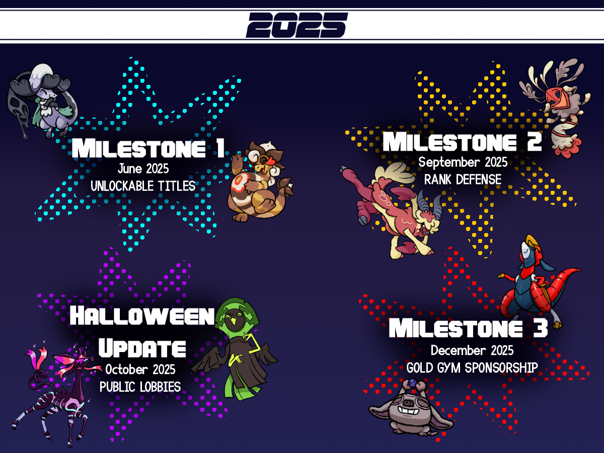
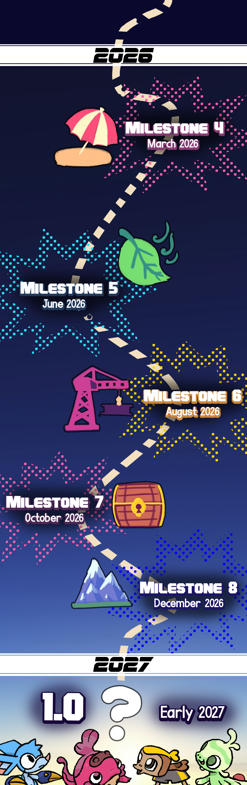

+++
title = "Beastieball: The Road to 1.0!"
slug = "beastieball-roadmap-2026"
description = "Beastieball's development roadmap to 1.0!"

[taxonomies]
tags = ["beastieball"]
# special tags: "musings" for devlog updates. "major-event" for only BIG NEW THINGS!

+++

HELLO! It's been some time since our last newsletter update. Previously we were on Substack, but it had more than its fair share of annoying engagement farming strategies, and some of our subscribers didn't like them for various other reasons. So, to ring in the new year, we've migrated to a completely custom self-published blog and newsletter setup. This was... VERY annoying and difficult to do... and may not be perfect... but now it's done! And we've become much more independent from other services! <!--{{EMAIL ONLY}}Come bask in our <a href="http://wishesgames.com">shiny new website!</a>{{EMAIL ONLY}}-->

<!--{{EMAIL ONLY}}
There are many, many posts I've been wanting to make but have been holding back from. You can expect updates from me to get a bit more frequent going forward again, like they used to be. If you want to adjust how often you get updates, I've got a <a href="https://1l5gt.mjt.lu/wgt/1l5gt/0tn9/form?c=1d067740">simplified set of options you can check out here (no new social platform accounts required!!!!)</a>. Or if you've realized you actually don't want to get emails from me again then please <a href="">unsubscribe!</a> I don't want to send you unwanted annoying emails any more than you want to receive them.
-->

For our first newsletter update in a long time, let's quickly catch up on what's been going on with <b>Beastieball</b> in 2025... and where it's headed!

<h1>Beastieball in 2025</h1>

In response to demand for PvP content, we fully developed an in-game matchmaking event system (The Bigmoon Bash!) and subsequently ran <strong>16 events</strong> throughout 2025 which each saw thousands of players play many more thousands of matches.

Then, from June to December 2025 we shipped <strong>4 major updates.</strong> In that time we went from <strong>18 fully-animated animated Beasties to 50.</strong> We expanded the game with a ton of new story content and added
<strong>
<a href="https://store.steampowered.com/news/app/1864950/view/520848458437886334">Rank Defense</a>
</strong>
(a totally original and exciting challenge mode - on top of the 3 that were already there)! And we added
<strong>
<a href="https://store.steampowered.com/news/app/1864950/view/547875764461111992">public lobbies</a>
</strong>,
allowing players to easily join PvP outside of events.

All of this is just a <em>tiiiiny slice</em> of everything we shipped in the last year. Reception has been overwhelmingly positive with 98+% positive reviews and playtime statistics that are well above average for titles on Steam. I want to give a warm thank you to all our supportive players and fans who have made such a wildly ambitious game possible for us to make.

<h1>What's next!</h1>

This year we're firmly setting our sights on wrapping up everything and moving towards 1.0. There are <strong>6 more milestone updates remaining.</strong> Now that we've settled into a stable cadence of production and releases, we can better forecast how long it'll take to finish everything else. That said, I want to be clear this is indeed <strong>a forecast, not a guarantee.</strong>

<strong>We're targeting full release in early 2027!</strong> To some players, this time might still seem far away; but for us on the team, who were toiling away at this game for years before anyone even knew about it, it's incredible to have a date so close and tangible ahead of us. Nobody is more excited to see this game finished than we are!

In the meantime: <strong>we're excited to bring more updates, story content, PvP events and more this year on our way to the big 1.0!</strong>

<h1>FAQ</h1>

<h3>What's the current state of the game in Early Access?</h3>

You can play the story from beginning to end credits, recruit every Beastie, and participate in tons of optional endless challenges, not to mention PvP matchmaking and regular timed events. What we called our initial "Early Access" release is what many games would call their full release. For anybody excited about Beastieball, we think the game already fully delivers on its promise. But we have been ever ambitious with our plans and have continued to grow and expand the game during its Early Access period.

The move to 1.0 is mostly going to be marked by all Beasties being animated and all character side stories being completable, along with other bonus content and features.

<h3>What other platform(s) are you planning for 1.0?</h3>

We'll make announcements about this - and more specific timing - when we get closer to the finish line! It's still far too soon to make any promises.

<h3>Any plans after 1.0?</h3>

We're working on an additional expansion called <strong>The Far Out</strong> which will release sometime after 1.0. We have a solid plan for everything in that expansion and will be actively developing it in 2026 alongside finishing the base content for 1.0. Don't expect any further information or details about this expansion until after we've released 1.0. ;)

...OK, no more questions! I gotta get back to work! But I expect I'll have to share soon that's more on the fun side.

-Greg
